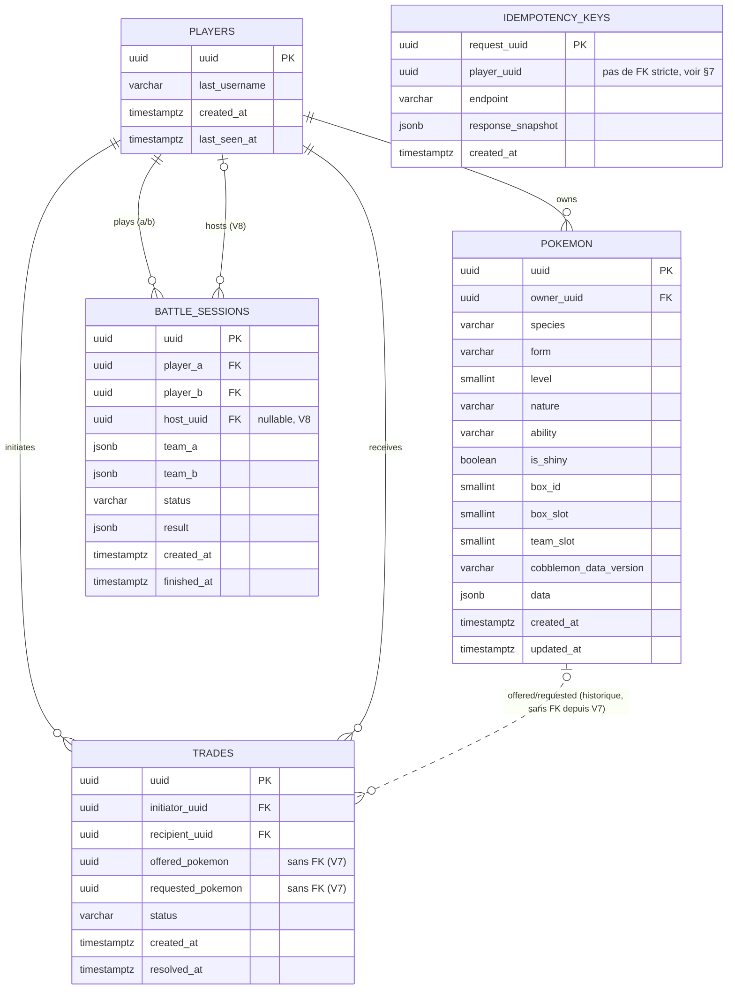

# Phantasmon Backend — Schéma de base de données PostgreSQL

**Statut :** V1 — première version du schéma
**Destinataire :** agents IA (Cursor) responsables de la génération du code backend
**Sources :** CAD Ghost Pokémon Parties 1, 2, 3 ; `CONTEXT_CURSOR_BACKEND.md` ; `phantasmon-backend-openapi.yaml`

Ce document est la référence unique pour créer les migrations Flyway du backend Phantasmon.
Il consolide et complète les fragments SQL dispersés dans le CAD (Partie 2 §5, Partie 3 §D) en un
schéma cohérent, prêt à être implémenté. Là où le CAD laissait un flou (nullabilité, contraintes
d'unicité, comportement `ON DELETE`), ce document tranche explicitement et le signale
(voir section 9 — Décisions non explicitement couvertes par le CAD).

---

## 1. Principes directeurs (rappel, non négociables)

Ces règles viennent de `CONTEXT_CURSOR_BACKEND.md` et s'appliquent à toute migration :

1. **Backend = source de vérité absolue.** Aucune donnée persistante Ghost n'existe ailleurs.
2. **Ne jamais faire confiance au client.** L'ownership est revérifié en base à chaque opération sensible — ce n'est pas un sujet de schéma, mais conditionne certains index (voir §3.2).
3. **Modèle hybride colonnes + JSONB** : colonne classique pour tout ce qui est filtré/indexé/contraint ; JSONB pour le reste (variable, spécifique, non interrogé directement).
4. **Pas de duplication des données Cobblemon.** Le JSONB `pokemon.data` et les colonnes `species`/`form`/`ability`/moves ne stockent que des **identifiants texte**, jamais des stats de base, ni de données de rendu.
5. **Migrations Flyway uniquement**, jamais de `ddl-auto: update`. Une migration appliquée n'est jamais modifiée rétroactivement — toute correction passe par une nouvelle migration.
6. **`PlayerPresence` n'est PAS une table.** C'est un état éphémère géré en mémoire côté backend (voir section 8). Ne créez aucune table pour cette donnée.
7. **Tests d'intégration sur PostgreSQL réel (Testcontainers)**, jamais H2 — le comportement JSONB diffère.

---

## 2. Vue d'ensemble (diagramme relationnel)

```text
players (uuid PK)
   │ 1
   │
   │ N
   ├──────────────► pokemon (uuid PK, owner_uuid FK → players.uuid)
   │                    │ N
   │                    │
   │ N          N       │ N
   ├──────► trades ◄╌╌╌╌┘
   │        (initiator_uuid FK, recipient_uuid FK → players.uuid)
   │        (offered_pokemon, requested_pokemon → pokemon.uuid, référence
   │         historique sans FK depuis V7 — voir §5.5)
   │
   │ N
   └──────► battle_sessions
            (player_a, player_b, host_uuid FK → players.uuid)
            (team_a, team_b : JSONB — snapshot de pokemon_uuid, pas de FK SQL)

idempotency_keys (request_uuid PK, player_uuid — pas de FK stricte, voir §7)
```

5 tables au total en V1 : `players`, `pokemon`, `trades`, `battle_sessions`, `idempotency_keys`.
Aucune autre table n'est nécessaire pour le périmètre V1 (pas de table `teams` séparée — voir §3.2 ;
pas de table `presence` — voir §8).

### 2.1 Diagramme ER (Mermaid)

Reflète l'état réellement appliqué par les migrations Flyway (`src/main/resources/db/migration/`).
Se rend nativement sur GitHub. À maintenir en même temps que toute migration ajoutée/modifiée.



`idempotency_keys.player_uuid` n'a volontairement pas de FK vers `players` (§7.3/§9.5) ; elle n'apparaît
donc pas comme une relation dans ce diagramme, seulement comme une colonne informative. De même,
`battle_sessions.team_a`/`team_b` sont des snapshots JSONB sans FK SQL vers `pokemon` (§6.4).

---

## 3. Table `players`

### 3.1 Rôle

Identité minimale d'un joueur Minecraft connu du système Ghost. Créée à la première connexion
réussie (flux Mojang `joinServer`/`hasJoined` → JWT, CAD Partie 2 §3).

### 3.2 DDL

```sql
CREATE TABLE players (
    uuid            UUID PRIMARY KEY,                 -- UUID Mojang du joueur (pas généré par le backend)
    last_username   VARCHAR(16) NOT NULL,              -- pseudo Minecraft (max 16 caractères, contrainte Mojang)
    created_at      TIMESTAMPTZ NOT NULL DEFAULT now(),
    last_seen_at    TIMESTAMPTZ
);
```

### 3.3 Colonnes

| Colonne | Type | Contraintes | Notes |
|---|---|---|---|
| `uuid` | UUID | PK | UUID Mojang du compte, jamais généré côté backend — vient de la réponse `hasJoined`. |
| `last_username` | VARCHAR(16) | NOT NULL | Les pseudos Minecraft peuvent changer ; mis à jour à chaque connexion réussie. |
| `created_at` | TIMESTAMPTZ | NOT NULL, DEFAULT now() | Première connexion. |
| `last_seen_at` | TIMESTAMPTZ | nullable | NULL avant toute connexion effective (théoriquement toujours renseigné dès la création, mais laissé nullable pour permettre un provisioning éventuel hors flux de connexion). |

### 3.4 Index

Aucun index additionnel nécessaire : `uuid` (PK) est la seule voie d'accès directe (auth par UUID).
Pas de recherche par `last_username` prévue en V1 (pas d'endpoint de lookup par pseudo).

---

## 4. Table `pokemon`

### 4.1 Rôle

Table centrale du système. Un Ghost Pokémon possède son propre UUID, indépendant de tout
Pokémon Cobblemon réel (CAD Partie 1 §3-§4). Le champ `data` (JSONB) porte tout ce qui est
variable et non filtré ; les colonnes classiques portent tout ce qui est filtré, indexé ou
contraint par une règle métier (légalité, position PC, équipe).

### 4.2 DDL

```sql
CREATE TABLE pokemon (
    uuid                    UUID PRIMARY KEY,
    owner_uuid              UUID NOT NULL REFERENCES players(uuid) ON DELETE RESTRICT,
    species                 VARCHAR(64) NOT NULL,
    form                    VARCHAR(64),
    level                   SMALLINT NOT NULL CHECK (level BETWEEN 1 AND 100),
    nature                  VARCHAR(32) NOT NULL,
    ability                 VARCHAR(64) NOT NULL,
    is_shiny                BOOLEAN NOT NULL DEFAULT FALSE,
    box_id                  SMALLINT CHECK (box_id BETWEEN 1 AND 16),
    box_slot                SMALLINT CHECK (box_slot BETWEEN 1 AND 30),
    team_slot               SMALLINT CHECK (team_slot BETWEEN 1 AND 6),   -- NULL si absent de l'équipe active
    cobblemon_data_version  VARCHAR(32) NOT NULL,
    data                    JSONB NOT NULL,
    created_at              TIMESTAMPTZ NOT NULL DEFAULT now(),
    updated_at              TIMESTAMPTZ NOT NULL DEFAULT now(),

    -- Un Pokémon occupe soit une case du PC, soit un slot d'équipe, jamais les deux à vide en même temps
    -- ni les deux box_id/box_slot partiellement renseignés (voir §9.3)
    CONSTRAINT chk_pokemon_box_coherent CHECK (
        (box_id IS NULL AND box_slot IS NULL) OR (box_id IS NOT NULL AND box_slot IS NOT NULL)
    )
);

CREATE INDEX idx_pokemon_owner ON pokemon(owner_uuid);
CREATE INDEX idx_pokemon_data_gin ON pokemon USING GIN (data);

-- Une case de PC ne peut être occupée que par un seul Pokémon pour un même propriétaire
CREATE UNIQUE INDEX uq_pokemon_pc_slot
    ON pokemon(owner_uuid, box_id, box_slot)
    WHERE box_id IS NOT NULL AND box_slot IS NOT NULL;

-- Un slot d'équipe active ne peut être occupé que par un seul Pokémon pour un même propriétaire
CREATE UNIQUE INDEX uq_pokemon_team_slot
    ON pokemon(owner_uuid, team_slot)
    WHERE team_slot IS NOT NULL;
```

### 4.3 Colonnes

| Colonne | Type | Contraintes | Notes |
|---|---|---|---|
| `uuid` | UUID | PK | Identité stable du Ghost Pokémon, ne change jamais (y compris lors d'un échange, CAD Partie 1 §4). |
| `owner_uuid` | UUID | NOT NULL, FK → `players.uuid` | Change lors d'un trade (§5). `ON DELETE RESTRICT` : un joueur avec des Pokémon ne peut être supprimé (pas d'endpoint de suppression de joueur en V1 de toute façon). |
| `species` | VARCHAR(64) | NOT NULL | Identifiant texte Cobblemon (ex. `samurott-hisui`), jamais de duplication de stats. |
| `form` | VARCHAR(64) | nullable | Forme alternative/régionale ; NULL = forme par défaut. |
| `level` | SMALLINT | NOT NULL, CHECK 1-100 | Borne 1-100 = convention standard des jeux Pokémon (non explicitée littéralement dans le CAD, à valider si un besoin de niveaux hors bornes apparaît). |
| `nature` | VARCHAR(32) | NOT NULL | Identifiant texte (ex. `timid`). |
| `ability` | VARCHAR(64) | NOT NULL | Identifiant texte. Pas de contrainte de cohérence espèce/capacité en base — portée par `PokemonLegalityService` (CAD Partie 3 §B), pas par une contrainte SQL, car la liste des capacités valides dépend des données Cobblemon côté client/serveur, pas d'une table de référence en base. |
| `is_shiny` | BOOLEAN | NOT NULL DEFAULT FALSE | |
| `box_id` | SMALLINT | CHECK 1-16, nullable | Boîte du Ghost PC (16 boîtes, CAD Partie 1 §12.1). NULL si le Pokémon n'est pas rangé en PC (cas transitoire uniquement — voir §9.3). |
| `box_slot` | SMALLINT | CHECK 1-30, nullable | Emplacement dans la boîte (30 = 6×5 — redimensionné depuis 6×6/36 le 2026-09-27, `V6__resize_pokemon_box.sql`, voir CAD Partie 1 §12.1 mis à jour). |
| `team_slot` | SMALLINT | CHECK 1-6, nullable | Slot dans l'équipe active. NULL = pas dans l'équipe active. Une équipe active incomplète est autorisée (CAD Partie 1 §15/§17) : les slots occupés n'ont pas besoin d'être contigus du point de vue base de données (l'ordre d'affichage 1-6 est géré côté client/service). |
| `cobblemon_data_version` | VARCHAR(32) | NOT NULL | Version Cobblemon au moment de la dernière création/modification (CAD Partie 2 §6.1) — sert de base à la détection d'incompatibilité côté client, aucune logique de migration auto en V1. |
| `data` | JSONB | NOT NULL | Voir structure détaillée §4.4. |
| `created_at` / `updated_at` | TIMESTAMPTZ | NOT NULL DEFAULT now() | `updated_at` doit être mis à jour applicativement (ou trigger, au choix de l'implémentation) à chaque `PATCH`. |

### 4.4 Structure du champ `data` (JSONB)

Reprise de CAD Partie 2 §5.2, **étendue** pour couvrir les champs fonctionnels requis par la
Partie 1 §3/§7 (surnom, genre, type Téra) qui n'apparaissent pas dans l'exemple JSON d'origine
mais sont listés comme obligatoires/personnalisables. Ces champs sont placés en JSONB (et non en
colonne) car ils ne sont ni filtrés, ni indexés, ni contraints par une règle d'intégrité relationnelle
— cohérent avec le principe du modèle hybride (§1 point 3). **Voir §9.1 pour le détail de cette décision.**

```json
{
  "nickname": "Bichou",
  "gender": "female",
  "tera_type": "grass",
  "ivs":  { "hp": 31, "atk": 12, "def": 20, "spa": 31, "spd": 25, "spe": 18 },
  "evs":  { "hp": 0,  "atk": 252, "def": 0, "spa": 0, "spd": 4,  "spe": 252 },
  "moves": ["avalanche", "aqua_tail", "megahorn", "protect"],
  "held_item": "leftovers",
  "friendship": 120,
  "origin": { "obtained_at": "2026-09-01T12:00:00Z", "method": "trade" }
}
```

Validée exclusivement par `PokemonLegalityService` côté service (jamais uniquement par une
annotation Bean Validation), à la création, à la modification, et à l'import Showdown
(CAD Partie 3 §B, `CONTEXT_CURSOR_BACKEND.md` règle 2) :

- `ivs` : chaque stat ∈ [0, 31].
- `evs` : chaque stat ∈ [0, 252] ; somme totale ≤ 510.
- `moves` : cohérence espèce/forme résolue via données Cobblemon locales (pas de contrainte SQL).
- `ability` : doit faire partie des abilities possibles pour l'espèce/forme (idem, pas de contrainte SQL).

### 4.5 Index

| Index | But |
|---|---|
| `idx_pokemon_owner` (btree, `owner_uuid`) | `GET /players/{uuid}/pokemon`, `GET /players/{uuid}/pc`, `GET /players/{uuid}/team`. |
| `idx_pokemon_data_gin` (GIN, `data`) | Requêtes futures sur le contenu JSONB (aucun endpoint V1 n'en a besoin explicitement, mais posé dès le départ par le CAD Partie 2 §5.1). |
| `uq_pokemon_pc_slot` (unique partiel) | Empêche deux Pokémon d'un même joueur d'occuper la même case de PC. Addition — non explicite dans le CAD, voir §9.2. |
| `uq_pokemon_team_slot` (unique partiel) | Empêche deux Pokémon d'un même joueur d'occuper le même slot d'équipe active. Addition — voir §9.2. |

---

## 5. Table `trades`

### 5.1 Rôle

Flux d'échange atomique entre deux joueurs, avec proposition/acceptation/annulation, sans
timeout (CAD Partie 3 §D).

### 5.2 DDL

```sql
CREATE TABLE trades (
    uuid                UUID PRIMARY KEY,
    initiator_uuid      UUID NOT NULL REFERENCES players(uuid) ON DELETE RESTRICT,
    recipient_uuid      UUID NOT NULL REFERENCES players(uuid) ON DELETE RESTRICT,
    offered_pokemon     UUID NOT NULL,   -- FK vers pokemon(uuid) retirée par V7 (§5.5)
    requested_pokemon   UUID NOT NULL,   -- idem
    status              VARCHAR(16) NOT NULL DEFAULT 'PENDING'
                         CHECK (status IN ('PENDING', 'ACCEPTED', 'CANCELLED', 'COMPLETED')),
    created_at          TIMESTAMPTZ NOT NULL DEFAULT now(),
    resolved_at         TIMESTAMPTZ,

    CONSTRAINT chk_trade_not_self CHECK (initiator_uuid <> recipient_uuid)
);

CREATE INDEX idx_trades_initiator ON trades(initiator_uuid);
CREATE INDEX idx_trades_recipient ON trades(recipient_uuid);
-- accélère GET /players/{uuid}/trades, qui interroge les deux rôles à la fois
CREATE INDEX idx_trades_status ON trades(status) WHERE status = 'PENDING';
```

### 5.3 Colonnes

| Colonne | Type | Contraintes | Notes |
|---|---|---|---|
| `uuid` | UUID | PK | |
| `initiator_uuid` | UUID | NOT NULL, FK → `players.uuid` | Celui qui propose. |
| `recipient_uuid` | UUID | NOT NULL, FK → `players.uuid` | Celui qui reçoit la proposition. |
| `offered_pokemon` | UUID | NOT NULL, indexé, **sans FK depuis `V7`** | Doit appartenir à `initiator_uuid` au moment de la création — vérifié en service, pas en contrainte SQL (l'ownership change dans le temps). Reste lisible même si le Pokémon est supprimé plus tard (historique). |
| `requested_pokemon` | UUID | NOT NULL, indexé, **sans FK depuis `V7`** | Doit appartenir à `recipient_uuid` au moment de la création — idem. |
| `status` | VARCHAR(16) | NOT NULL, CHECK ∈ {PENDING, ACCEPTED, CANCELLED, COMPLETED}, DEFAULT 'PENDING' | Le CHECK est une addition au SQL du CAD (qui ne posait qu'un commentaire) — garantit l'intégrité même en cas de bug applicatif. Voir §9.2. |
| `created_at` | TIMESTAMPTZ | NOT NULL DEFAULT now() | |
| `resolved_at` | TIMESTAMPTZ | nullable | Renseigné à l'acceptation ou l'annulation ; NULL tant que `PENDING`. |

`chk_trade_not_self` : addition non explicite dans le CAD, mais qui empêche un état absurde (un
joueur qui échangerait avec lui-même) sans coût — voir §9.2.

### 5.4 Comportement transactionnel (rappel, pas un objet de schéma)

L'acceptation (`POST /trades/{uuid}/accept`) doit s'exécuter dans **une transaction unique** qui :
1. revérifie l'ownership réel des deux Pokémon (protection contre un état changé entre-temps) ;
2. échange les deux `pokemon.owner_uuid` ;
3. passe `trades.status` à `COMPLETED` et renseigne `resolved_at`.

Si l'un des deux Pokémon n'appartient plus au joueur attendu → rollback intégral, `status = CANCELLED`.
Ce comportement est applicatif (`@Transactional`), le schéma ne peut pas l'imposer seul.

### 5.5 Colonnes `offered_pokemon`/`requested_pokemon` : historique sans FK (`V7`, 2026-10-02)

À l'origine (`V3`) ces deux colonnes avaient une FK `ON DELETE RESTRICT` vers `pokemon(uuid)`, pour
bloquer la suppression d'un Pokémon engagé dans un trade `PENDING` (§9.4). Effet de bord découvert en
construisant l'écran d'échange : la FK bloquait aussi la suppression de **tout Pokémon ayant déjà été
échangé**, même longtemps après un trade `COMPLETED`/`CANCELLED` (`DELETE /pokemon/{uuid}` finissait en
violation de contrainte brute, erreur 500) — et l'échange en direct crée une ligne `COMPLETED` à chaque
échange. Validé avec Adrien : `V7` retire ces deux FK (les FK vers `players` restent), et ajoute un index
sur chacune des deux colonnes. Le seul cas qui méritait d'être bloqué — un Pokémon d'un trade **`PENDING`**
— est désormais vérifié par l'application (`PokemonService.delete`, erreur `ERROR_POKEMON_IN_PENDING_TRADE`,
409). Les lignes terminées deviennent un historique, même logique que `battle_sessions.team_a`/`team_b`
(§6.4).

---

## 6. Table `battle_sessions`

### 6.1 Rôle

Session de combat Ghost entre deux joueurs. Le combat lui-même est arbitré côté client hôte
(CAD Partie 2 §9) ; le backend ne stocke que la structure de session et le résultat, avec des
garde-fous de cohérence (CAD Partie 2 §9.2, Partie 4 Phase 4).

### 6.2 DDL

```sql
CREATE TABLE battle_sessions (
    uuid            UUID PRIMARY KEY,
    player_a        UUID NOT NULL REFERENCES players(uuid) ON DELETE RESTRICT,
    player_b        UUID NOT NULL REFERENCES players(uuid) ON DELETE RESTRICT,
    team_a          JSONB NOT NULL,   -- snapshot des pokemon_uuid impliqués côté player_a
    team_b          JSONB NOT NULL,   -- snapshot des pokemon_uuid impliqués côté player_b
    status          VARCHAR(16) NOT NULL DEFAULT 'PENDING'
                     CHECK (status IN ('PENDING', 'ACTIVE', 'FINISHED', 'ABORTED')),
    result          JSONB,
    created_at      TIMESTAMPTZ NOT NULL DEFAULT now(),
    finished_at     TIMESTAMPTZ,

    CONSTRAINT chk_battle_not_self CHECK (player_a <> player_b)
);

CREATE INDEX idx_battle_player_a ON battle_sessions(player_a);
CREATE INDEX idx_battle_player_b ON battle_sessions(player_b);

-- V8 (2026-10-03) : combats en direct, client hôte
ALTER TABLE battle_sessions ADD COLUMN host_uuid UUID REFERENCES players(uuid) ON DELETE RESTRICT;
CREATE INDEX idx_battle_host ON battle_sessions(host_uuid);
```

### 6.3 Colonnes

| Colonne | Type | Contraintes | Notes |
|---|---|---|---|
| `uuid` | UUID | PK | |
| `player_a` / `player_b` | UUID | NOT NULL, FK → `players.uuid` | `player_a` = initiateur par convention applicative (utile pour l'alternance de l'hôte, CAD Partie 3 §D.2 /Partie 2 §9.2). |
| `host_uuid` | UUID | nullable, FK → `players.uuid`, indexé (`V8`) | Client qui a fait tourner le moteur de combat. Renseigné pour les combats en direct (WebSocket, Phase 9), où `player_a` = l'hôte ; NULL pour les sessions créées par `POST /battles`. Sert à l'alternance de l'hôte entre deux mêmes joueurs. |
| `team_a` / `team_b` | JSONB | NOT NULL | Snapshot des `pokemon_uuid` engagés au moment du combat — **pas** de FK SQL vers `pokemon`, car un snapshot doit rester lisible même si le Pokémon est modifié/supprimé après coup (historique d'audit). Volontairement pas de contrainte référentielle ici. |
| `status` | VARCHAR(16) | NOT NULL, CHECK ∈ {PENDING, ACTIVE, FINISHED, ABORTED} | CHECK ajouté par ce document, cf. §9.2. |
| `result` | JSONB | nullable | NULL tant que le combat n'est pas terminé. Contenu : vainqueur, log de combat (voir `POST /battles/{uuid}/result` dans l'OpenAPI). |
| `created_at` / `finished_at` | TIMESTAMPTZ | `finished_at` nullable | |

`chk_battle_not_self` : même logique que pour `trades`, addition de bon sens non explicitée par le CAD.

### 6.4 Sur l'absence de FK vers `pokemon` pour `team_a`/`team_b`

Comme `trades.offered_pokemon`/`requested_pokemon` depuis `V7` (§5.5), `team_a`/`team_b` sont des
**snapshots historiques** : le CAD
Partie 2 §5.1 les type explicitement en JSONB (pas en colonne relationnelle), signe qu'ils ne
doivent pas suivre les modifications ultérieures du Pokémon. Ce choix est donc conforme au CAD,
pas une extrapolation de ce document.

---

## 7. Table `idempotency_keys`

### 7.1 Rôle

Anti-duplication sur les endpoints `POST` sensibles (`/pokemon`, `/trades`, `/battles`),
CAD Partie 2 §12, règle 3 de `CONTEXT_CURSOR_BACKEND.md`.

### 7.2 DDL

```sql
CREATE TABLE idempotency_keys (
    request_uuid        UUID PRIMARY KEY,
    player_uuid          UUID NOT NULL,
    endpoint              VARCHAR(64) NOT NULL,
    response_snapshot     JSONB,
    created_at             TIMESTAMPTZ NOT NULL DEFAULT now()
);

CREATE INDEX idx_idempotency_player_endpoint ON idempotency_keys(player_uuid, endpoint);
```

### 7.3 Colonnes

| Colonne | Type | Contraintes | Notes |
|---|---|---|---|
| `request_uuid` | UUID | PK | Généré côté client, fourni par le joueur/mod à chaque requête sensible. |
| `player_uuid` | UUID | NOT NULL, **pas de FK** | Volontairement sans contrainte référentielle stricte vers `players.uuid` : cette table est un journal technique d'idempotence, pas une donnée métier relationnelle ; elle ne doit jamais bloquer ou être bloquée par le cycle de vie de `players`. Voir §9.5. |
| `endpoint` | VARCHAR(64) | NOT NULL | Ex. `POST /pokemon`, `POST /trades`, `POST /battles`. |
| `response_snapshot` | JSONB | nullable | Réponse originale, renvoyée telle quelle si la clé est déjà vue. |
| `created_at` | TIMESTAMPTZ | NOT NULL DEFAULT now() | Base pour une éventuelle politique de rétention/purge future (non spécifiée en V1). |

### 7.4 Index

`idx_idempotency_player_endpoint` : addition de ce document pour accélérer la vérification
"cette clé a-t-elle déjà été vue pour ce joueur/cet endpoint" en complément du lookup direct par PK.

---

## 8. Ce qui n'est PAS en base : `PlayerPresence`

Rappel explicite (CAD Partie 3 §F, `CONTEXT_CURSOR_BACKEND.md` règle 7) : `PlayerPresence` est un
état **éphémère**, tenu en mémoire côté instance backend, jamais persisté en PostgreSQL.

```text
PlayerPresence (en mémoire, PAS une table SQL)
   ├── player_uuid
   ├── server_fingerprint
   ├── dimension
   ├── position
   ├── active_ghost_pokemon (liste de pokemon_uuid actuellement "sortis")
   └── last_heartbeat_at
```

Nettoyée par une tâche planifiée (`@Scheduled`, TTL ~30s sur `last_heartbeat_at`, CAD Partie 3 §F).
**N'écrivez aucune migration Flyway pour cette structure.** Si un besoin de scalabilité
multi-instance apparaît un jour, l'externalisation (Redis) sera traitée hors de ce schéma SQL
(hors scope V1, CAD Partie 3 §H).

---

## 9. Décisions non explicitement couvertes par le CAD (à valider)

Le CAD est précis sur l'essentiel mais laisse quelques détails de schéma implicites. Ce document
tranche pour pouvoir livrer un schéma exécutable ; ces points restent ouverts à validation par le
porteur de projet avant la Phase 1 (CAD Partie 4).

### 9.1 Placement de `nickname`, `gender`, `tera_type`

Le CAD Partie 1 §3.1 liste le surnom, le genre et le type Téra comme des attributs minimaux d'un
Ghost Pokémon, personnalisables (§7). Mais ni l'exemple JSONB de la Partie 2 §5.2, ni le schéma
OpenAPI `Pokemon`, ne les mentionnent explicitement. Ce document les place en JSONB (`data`) par
cohérence avec le principe du modèle hybride (aucun des trois n'est filtré/indexé/contraint en
V1). **Alternative à considérer** : si une recherche par surnom ou un filtre par genre s'avère
nécessaire plus tard, ces champs devraient migrer vers des colonnes dédiées (migration Flyway
additive).

### 9.2 Contraintes `CHECK` et index d'unicité ajoutés

Le CAD donne du SQL illustratif sans contraintes `CHECK` sur les `status` ni d'index d'unicité sur
les positions PC/équipe. Ce document les ajoute (`chk_*`, `uq_pokemon_pc_slot`,
`uq_pokemon_team_slot`, `chk_trade_not_self`, `chk_battle_not_self`) parce qu'ils empêchent des
états incohérents à moindre coût, sans contredire aucune règle du CAD. Ils peuvent être retirés
sans casser le reste du schéma si l'équipe préfère porter cette validation entièrement en service.

### 9.3 Nullabilité de `box_id`/`box_slot`

Le DDL du CAD Partie 2 §5.1 ne marque `box_id`/`box_slot` ni `NOT NULL` ni explicitement
nullable. Ce document les garde nullables (un Pokémon peut être exclusivement en équipe active
sans case PC assignée), mais recommande qu'au niveau service, tout Pokémon nouvellement créé
reçoive une position PC par défaut, sauf placement direct en équipe — à confirmer lors de
l'implémentation de `POST /pokemon`.

### 9.4 `ON DELETE RESTRICT` sur les FK `pokemon` de `trades` (remplacé par `V7`, voir §5.5)

> **Remplacé le 2026-10-02** : ces FK bloquaient aussi la suppression des Pokémon de trades terminés.
> Elles ont été retirées par `V7` ; la règle ci-dessous (ne pas supprimer un Pokémon d'un trade `PENDING`)
> est conservée mais appliquée par le code (`ERROR_POKEMON_IN_PENDING_TRADE`). Texte d'origine :

Non spécifié par le CAD. Ce document choisit `RESTRICT` plutôt que `CASCADE` : supprimer un
Pokémon engagé dans un trade `PENDING` ne doit pas faire disparaître silencieusement le trade —
c'est à l'application d'annuler le trade explicitement avant suppression, cohérent avec l'esprit
CAD Partie 1 §20 ("la suppression doit gérer les références existantes... afin d'éviter des
références invalides"). Si ce comportement bloque un cas d'usage réel (ex. suppression forcée par
un admin), il faudra un endpoint dédié qui annule le(s) trade(s) avant suppression.

### 9.5 Absence de FK sur `idempotency_keys.player_uuid`

Choix délibéré de ce document : une table de déduplication technique ne doit jamais échouer ou
bloquer à cause d'un cycle de vie de `players` (par exemple si `players` évolue plus tard vers une
politique de purge). Si l'intégrité référentielle stricte est préférée, ajouter
`REFERENCES players(uuid)` ne casse rien du reste du schéma.

---

## 10. Convention de migration Flyway

```text
src/main/resources/db/migration/
├── V1__init_players.sql
├── V2__init_pokemon.sql
├── V3__init_trades.sql
├── V4__init_battle_sessions.sql
├── V5__init_idempotency_keys.sql
├── V6__resize_pokemon_box.sql
├── V7__trades_pokemon_history_without_fk.sql
└── V8__battle_sessions_host.sql
```

Une table = une migration, dans l'ordre de dépendance des FK (`players` avant `pokemon`,
`pokemon`/`players` avant `trades` et `battle_sessions`). Toute évolution future du schéma
passe par une nouvelle migration, jamais par une modification de celles déjà appliquées —
`V6` (2026-09-27) en est l'illustration : elle rétrécit la contrainte `CHECK` sur `box_slot`
(36 → 30, boîte 6×5) plutôt que d'éditer la contrainte inline de `V2`. Comme cette contrainte
n'avait pas de nom explicite dans `V2` (Postgres en génère un automatiquement,
`pokemon_box_slot_check`), `V6` le retrouve dynamiquement via `pg_constraint` avant de la
remplacer par une contrainte nommée (`chk_pokemon_box_slot`) — plus robuste qu'un nom deviné
en dur si la convention de nommage automatique de Postgres venait à changer. `V7` (2026-10-02)
applique la même méthode pour retirer les FK `trades → pokemon` de `V3`, elles aussi non nommées
(recherchées via `pg_constraint` par table cible `pokemon`, §5.5).

---

## 11. Ce que ce schéma laisse volontairement de côté (V1)

- Pas de table `teams` séparée : une seule équipe active par joueur, portée par `pokemon.team_slot`
  (conforme à l'API `GET/PUT /players/{uuid}/team`, qui manipule un tableau d'UUID, pas un modèle
  d'équipes multiples nommées — malgré la mention de "plusieurs équipes" en CAD Partie 1 §15, resté
  au milieu d'équipes multiples non repris dans l'architecture technique Partie 2/3 ni l'OpenAPI ;
  **point à reconfirmer** si le besoin d'équipes multiples nommées est toujours d'actualité).
- Pas de table de référence Cobblemon (espèces/attaques/capacités) : ces données restent côté
  client, le backend ne stocke que des identifiants texte (CAD Partie 2 §6).
- Pas de table de logs applicatifs (CAD Partie 2 §17 recommande un logging structuré, mais ne
  demande pas explicitement une persistance en base — probablement un système de logs externe,
  hors périmètre de ce schéma).
- Pas de quota/cooldown de création (CAD Partie 3 §C, accès libre confirmé).
- Pas de scalabilité multi-instance (CAD Partie 3 §H).
