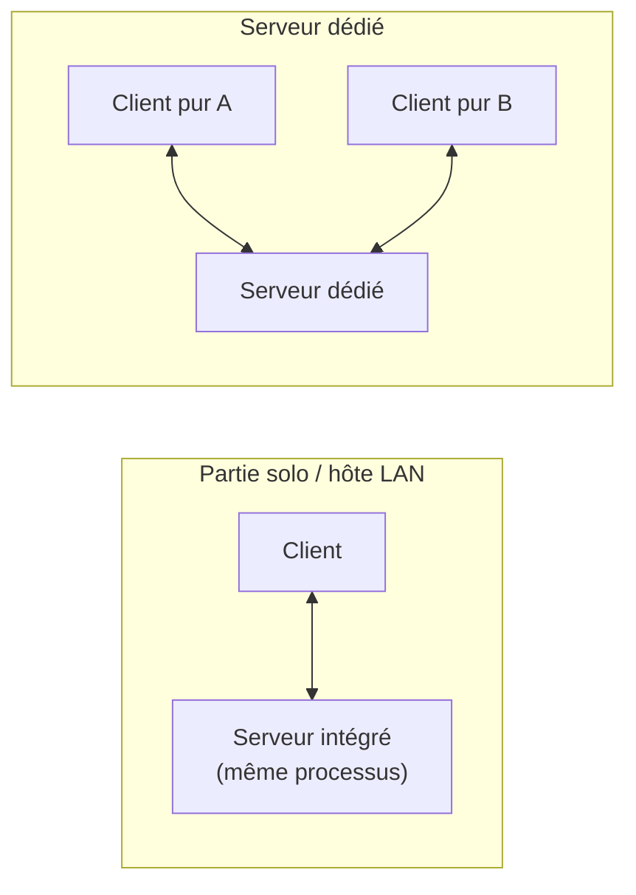
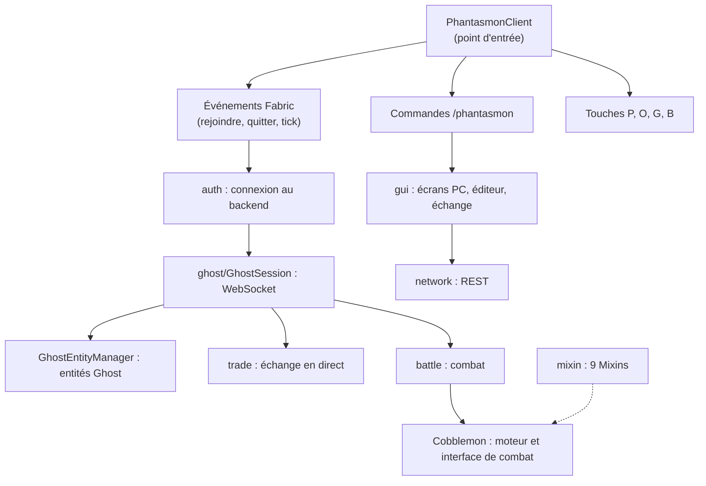

# 1. Le modding Minecraft

## 1.1 Le jeu est en deux parties

Minecraft Java Edition contient **toujours** deux programmes logiques :

| Partie | Rôle |
|---|---|
| **Serveur** | Fait autorité sur le monde : blocs, entités, inventaires, combats Cobblemon, règles. Calcule le monde 20 fois par seconde (*ticks*). |
| **Client** | Affiche le monde, lit le clavier et la souris, joue les sons et animations, envoie les actions du joueur au serveur. |

Ils communiquent par **paquets** réseau. Quand vous jouez en solo, un **serveur intégré** tourne dans le même
processus que votre client (sur un autre thread). « Ouvrir au LAN » expose ce serveur intégré aux autres joueurs.
Sur un serveur multijoueur, le serveur est un programme séparé sur une autre machine : votre client est alors un
« client pur ».

## 1.2 Qu'est-ce qu'un mod

Minecraft n'a pas d'API officielle pour les mods Java. Un **loader** (chargeur) démarre le jeu, charge les mods et
leur offre des points d'accroche :

| Loader | Remarques |
|---|---|
| **Fabric** | Léger, rapide à suivre les nouvelles versions ; utilisé par Phantasmon |
| NeoForge / Forge | Historiques, API plus étendues |
| Quilt | Dérivé de Fabric |

Un mod Fabric est un fichier `.jar` dans le dossier `mods/`. Il contient du code Java, des ressources (textures,
traductions) et un fichier `fabric.mod.json` qui le décrit. **Fabric API** est un mod séparé, presque toujours
requis, qui fournit les accroches courantes (événements, commandes, touches).

Un mod peut agir de trois façons :

1. **Utiliser les API** : écouter un événement (« quand le joueur rejoint un monde »), enregistrer une commande,
   ajouter une touche.
2. **Appeler directement le code du jeu** : les classes de Minecraft sont accessibles depuis le mod.
3. **Modifier le code du jeu** au chargement avec des **Mixins** (chapitre 10), quand rien d'autre ne suffit.

## 1.3 Un mod « client uniquement »

La plupart des mods de contenu (nouveaux blocs, nouvelles créatures) doivent être installés **des deux côtés**,
car le serveur doit connaître ces blocs et créatures. Phantasmon est un mod **client uniquement** : aucun code sur
le serveur. Conséquences :

| On peut | On ne peut pas |
|---|---|
| Afficher des écrans, du texte, des entités **locales** | Créer une vraie entité que le serveur connaît |
| Ajouter des commandes et des touches côté client | Ajouter une commande serveur, des blocs, des objets |
| Lire ce que le client sait du monde | Changer les règles du serveur |
| Parler à un **autre** serveur (notre backend) | Faire confiance au client pour une règle importante |

C'est pourquoi les Ghost sont des entités créées par chaque client dans **son** monde local (chapitre 8), et
pourquoi les données et les règles vivent dans le backend. Un joueur sans le mod ne voit rien, et le serveur ne
sait même pas que le mod existe.

## 1.4 Cobblemon

Cobblemon est un mod (installé client **et** serveur) qui ajoute les Pokémon à Minecraft : espèces, modèles 3D,
animations, combats basés sur le moteur **Pokémon Showdown**, interfaces. Phantasmon **dépend** de Cobblemon et
réutilise son code : ses modèles pour afficher les Ghost, son interface de combat, son moteur de combat, ses
données (espèces, talents, attaques, objets). Cobblemon est écrit en **Kotlin**, un autre langage de la JVM, ce qui
a des conséquences pratiques (chapitre 11).

## 1.5 Les versions comptent

Un mod est écrit pour une version précise du jeu (ici **Minecraft 1.21.1**) et de ses dépendances (**Fabric Loader
≥ 0.18.1**, **Fabric API**, **Cobblemon 1.8.1**). Le code de Minecraft change à chaque version : noms de classes,
signatures, systèmes de rendu. Une grande partie du travail de modding consiste à vérifier ce qui existe **dans la
version utilisée**, et non dans un tutoriel écrit pour une autre (chapitres 3 et 11).

## 1.6 Vue d'ensemble du mod

## À retenir

- Minecraft = un serveur qui fait autorité + un client qui affiche ; en solo, un serveur intégré.
- Fabric charge les mods ; Fabric API fournit les accroches courantes.
- Un mod client uniquement n'agit que sur le jeu du joueur : affichage local, commandes et touches locales, et
  dialogue avec un serveur externe.
- Toujours travailler contre la version exacte du jeu et des mods utilisés.
