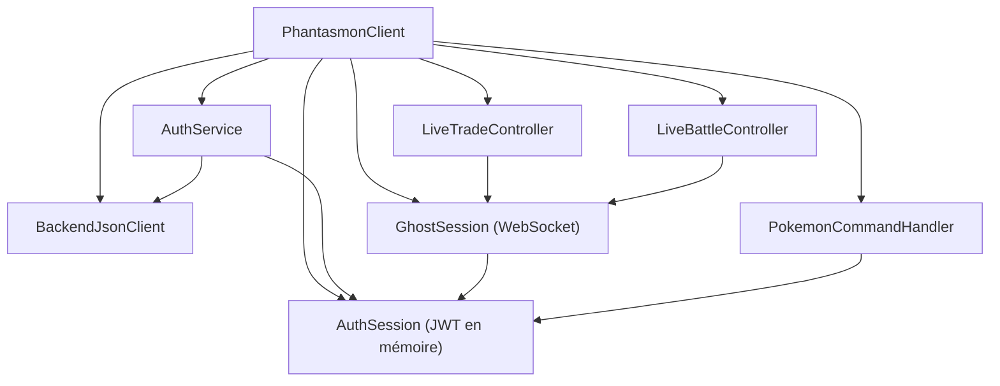

# 4. Anatomie d'un mod Fabric

## 4.1 L'arborescence

```text
Phantasmon-Client/
├── build.gradle, gradle.properties, settings.gradle     construction (chapitre 3)
├── src/main/
│   ├── java/com/mystaria/phantasmon/Phantasmon.java      point d'entrée commun
│   └── resources/
│       ├── fabric.mod.json                               carte d'identité du mod
│       ├── phantasmon.mixins.json                        Mixins communs (vide)
│       └── assets/phantasmon/                            ressources « client »
│           ├── icon.png
│           ├── lang/fr_fr.json, en_us.json               traductions
│           └── textures/gui/…                            textures des écrans
├── src/client/
│   ├── java/com/mystaria/phantasmon/client/…             tout le code du mod
│   └── resources/phantasmon.client.mixins.json           Mixins côté client
├── src/test/java/…                                       tests unitaires
└── scripts/generate_trade_textures.py                    génère des textures
```

## 4.2 Deux jeux de sources : `main` et `client`

`splitEnvironmentSourceSets()` sépare le code en deux :

- `src/main` : code qui pourrait exister des deux côtés (client et serveur). Il ne peut **pas** utiliser les classes
  réservées au client (rendu, écrans, entrées).
- `src/client` : code qui n'existe que dans le client et peut tout utiliser.

Le compilateur empêche ainsi d'utiliser par erreur une classe client dans du code commun, qui ferait planter un
serveur. Phantasmon étant client uniquement, presque tout est dans `src/client`.

## 4.3 `fabric.mod.json`

```json
{
  "schemaVersion": 1,
  "id": "phantasmon",
  "version": "${version}",
  "name": "Phantasmon",
  "license": "GPL-3.0-only",
  "icon": "assets/phantasmon/icon.png",
  "environment": "client",
  "entrypoints": {
    "main":   ["com.mystaria.phantasmon.Phantasmon"],
    "client": ["com.mystaria.phantasmon.client.PhantasmonClient"]
  },
  "mixins": [
    "phantasmon.mixins.json",
    { "config": "phantasmon.client.mixins.json", "environment": "client" }
  ],
  "depends": {
    "fabricloader": ">=0.18.1",
    "minecraft": "~1.21.1",
    "java": ">=21",
    "fabric-api": "*",
    "cobblemon": ">=1.8.1"
  }
}
```

| Champ | Rôle |
|---|---|
| `id` | Identifiant unique du mod ; sert aussi d'**espace de noms** des ressources (`phantasmon:…`) |
| `version` | `${version}` est remplacé à la construction par la valeur de `gradle.properties` |
| `environment: "client"` | Fabric ne charge jamais ce mod sur un serveur |
| `entrypoints` | Les classes que Fabric appelle au démarrage |
| `mixins` | Les fichiers de configuration Mixin (chapitre 10) |
| `depends` | Versions requises ; Fabric refuse de démarrer avec un message clair si une dépendance manque |

## 4.4 Les points d'entrée

```java
// src/main/java/com/mystaria/phantasmon/Phantasmon.java
public class Phantasmon implements ModInitializer {
    public static final String MOD_ID = "phantasmon";
    public static final Logger LOGGER = LoggerFactory.getLogger(MOD_ID);
    public void onInitialize() { LOGGER.info("Phantasmon client loaded"); }
}
```

```java
// PhantasmonClient.java (raccourci)
public class PhantasmonClient implements ClientModInitializer {
    private final BackendJsonClient httpClient = new BackendJsonClient();
    private final AuthSession authSession = new AuthSession();
    private final AuthService authService = new AuthService(httpClient, authSession);
    private final GhostSession ghostSession = new GhostSession(authSession);
    …
    @Override
    public void onInitializeClient() {
        authService.setOnAuthenticated(ghostSession::start);       // relier les services entre eux
        ClientPlayConnectionEvents.JOIN.register(…);               // écouter des événements (chapitre 5)
        ClientTickEvents.END_CLIENT_TICK.register(…);
        PhantasmonKeybinds.register();                             // touches (chapitre 6)
        PhantasmonCommands.register(authService, …);               // commandes (chapitre 6)
    }
}
```

`onInitializeClient` est appelé **une fois**, au lancement du jeu, avant qu'aucun monde ne soit chargé. Il ne doit
rien faire de lourd : il **branche** les services sur les événements.

Il n'y a pas de framework d'injection comme Spring : `PhantasmonClient` crée lui-même chaque service et passe à
chacun ce dont il a besoin (injection « à la main » par constructeur). C'est le seul endroit qui connaît tout le
graphe d'objets.



## 4.5 Les ressources et l'espace de noms

Tout ce qui est sous `assets/<id du mod>/` est chargé comme un pack de ressources. Un fichier est désigné par un
`ResourceLocation` « espace:chemin » :

```java
ResourceLocation.fromNamespaceAndPath("phantasmon", "textures/gui/trade/background.png")
// → src/main/resources/assets/phantasmon/textures/gui/trade/background.png
```

| Dossier | Contenu |
|---|---|
| `lang/` | Un fichier JSON par langue : clé → texte (chapitre 6) |
| `textures/gui/` | Images PNG des écrans |
| `textures/gui/sprites/` | « Sprites » de l'atlas GUI, désignés sans `textures/` ni `.png` (`phantasmon:pc/star`) |
| `*.png.mcmeta` | Métadonnées d'une texture : étirement en « nine-slice », filtrage lissé (`"blur": true`) |

Les ressources de Cobblemon sont dans l'espace `cobblemon:` (modèles, textures, sons) : on peut les utiliser sans
les copier.

## À retenir

- `fabric.mod.json` décrit le mod : identifiant, environnement, points d'entrée, Mixins, dépendances.
- `onInitializeClient` branche les services sur les événements ; le graphe d'objets est construit à la main.
- `src/client` pour le code client, `assets/<id>/` pour les ressources, désignées par `espace:chemin`.
