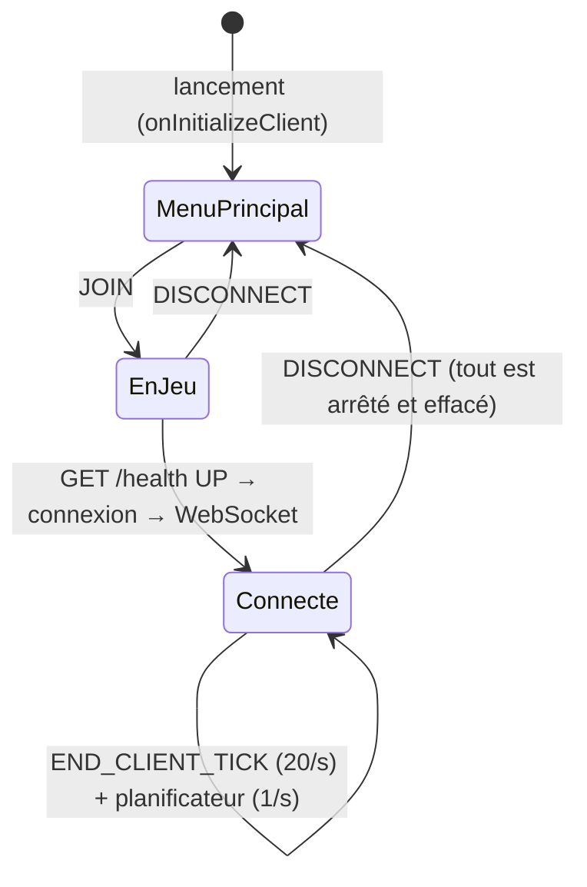

# 5. La boucle de jeu et les événements

## 5.1 Ticks et images

Le jeu avance par **ticks** : 20 par seconde, chacun mettant à jour la logique (positions, animations, entrées).
Entre deux ticks, le client dessine autant d'**images** qu'il peut (60, 144…), en interpolant les positions avec
un facteur `partialTick` (entre 0 et 1) pour que le mouvement soit fluide.

| Moment | Fréquence | Usage dans Phantasmon |
|---|---|---|
| Tick client | 20 / s | Déplacer les Ghost, détecter mort et changement de dimension, lire les touches, ouvrir un écran demandé |
| Rendu d'une image | Variable | Dessiner les écrans (`render`) ; Minecraft dessine lui-même les entités |
| Planificateur maison | 1 / s | Envoyer position et heartbeat au backend |

## 5.2 Les événements Fabric

Un **événement** est un point d'accroche : on y enregistre une fonction que Fabric appellera au bon moment.

```java
// PhantasmonClient.java
ClientPlayConnectionEvents.JOIN.register((handler, sender, client) -> {      // le joueur entre dans un monde
    pingToggle.onJoin();
    refreshScheduler.start();
    authService.autoLoginIfBackendHealthy();
});
ClientPlayConnectionEvents.DISCONNECT.register((handler, client) -> {        // il en sort
    pingToggle.onDisconnect();
    refreshScheduler.stop();
    ghostSession.stop();
    BattleVisuals.clear();
    authSession.clear();
});
ClientTickEvents.END_CLIENT_TICK.register(client -> {                       // à la fin de chaque tick client
    ghostSession.onClientTick();
    pokemonCommands.tick();
    liveTrade.tick();
    liveBattle.tick();
    PhantasmonKeybinds.tick(pokemonCommands, ghostSession, liveTrade, liveBattle);
});
```

Ces trois événements suffisent à tout le cycle de vie du mod :



Règle de propreté : **tout ce qui démarre à JOIN s'arrête à DISCONNECT**. Un planificateur oublié continuerait à
envoyer des messages au backend depuis le menu principal.

## 5.3 Sur quel thread s'exécute quoi

Les événements Fabric et les commandes s'exécutent sur le **thread client** : on peut y toucher au jeu. Les
réponses réseau arrivent sur d'autres threads et doivent revenir par `Minecraft.getInstance().execute(...)`
(chapitre 2.1) :

```java
// ghost/GhostSession.java — un message WebSocket arrive sur un thread réseau…
case "GhostEntityDespawn" -> Minecraft.getInstance().execute(() -> {     // …et on revient sur le thread client
    UUID ownerUuid = uuid(data.get("player_uuid"));
    if (ownerUuid != null) {
        entityManager.despawn(ownerUuid);                                // manipuler le monde : thread client uniquement
    }
});
```

## 5.4 Faire une action « au prochain tick »

Parfois une action doit être **différée** au tick suivant. Exemple réel : ouvrir un écran depuis une commande.

```java
// pokemon/PokemonCommandHandler.java
private volatile boolean pcScreenRequested;

public void openPc(FabricClientCommandSource source) {      // appelé pendant l'exécution de la commande
    if (!requireAuthenticated(source)) return;
    pcScreenRequested = true;                               // on demande seulement
}

public void tick() {                                        // appelé à chaque END_CLIENT_TICK
    if (pcScreenRequested) {
        pcScreenRequested = false;
        Minecraft.getInstance().setScreen(new PhantasmonPcScreen(pokemonClient, session));
    }
}
```

Pourquoi : après avoir exécuté une commande tapée dans le chat, Minecraft ferme l'écran du chat avec
`setScreen(null)`, **sans vérifier** si un autre écran a été ouvert entre-temps. Un écran ouvert pendant la commande
était donc fermé aussitôt (chapitre 14, cas 1). Au tick suivant, le chat est déjà fermé : l'écran reste.

## 5.5 Lire l'état du jeu

| Accès | Contenu |
|---|---|
| `Minecraft.getInstance()` | Le client (singleton) |
| `.player` | Le joueur local (`null` au menu) |
| `.level` | Le monde chargé côté client (`ClientLevel`, `null` au menu) |
| `.getUser()` | Le compte (nom, UUID, jeton d'accès, type) |
| `.getCurrentServer()` | Le serveur rejoint (adresse) ; `isLocalServer()` vrai en solo / hôte LAN |
| `.getSingleplayerServer()` | Le serveur intégré s'il existe |
| `player.level().dimension()` | Dimension actuelle (`minecraft:overworld`…) |
| `player.isDeadOrDying()` | Mort du joueur |

```java
// ghost/GhostSession.java — appelé à chaque tick
public void onClientTick() {
    if (!connected) return;
    Player player = Minecraft.getInstance().player;
    if (player == null) return;
    entityManager.tick();                                                    // déplacer les Ghost
    if (player.isDeadOrDying() && activeGhostPokemonUuid != null) { recall(); return; }
    var currentDimension = player.level().dimension();
    if (lastKnownDimension != null && !lastKnownDimension.equals(currentDimension) && activeGhostPokemonUuid != null) {
        recall();                                                            // changement de dimension : rappel
    }
    lastKnownDimension = currentDimension;
}
```

Fabric ne fournit pas d'événement simple « changement de dimension » côté client : comparer à chaque tick est
simple, peu coûteux et fiable.

## À retenir

- 20 ticks par seconde pour la logique ; le rendu va aussi vite que possible.
- Les événements Fabric (`JOIN`, `DISCONNECT`, `END_CLIENT_TICK`) structurent tout le cycle de vie ; ce qui démarre
  à l'entrée s'arrête à la sortie.
- Revenir sur le thread client pour toucher au jeu ; différer au tick suivant quand le jeu fait encore quelque chose.
