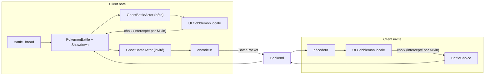

# 12. Le moteur de combat

C'est la partie la plus avancée du mod. Elle combine tout ce qui précède : threads, réseau, Mixins, entités,
intégration de Cobblemon. Côté backend, le combat n'est qu'un relais (parcours backend, chapitre 12).

## 12.1 L'idée : faire tourner du code serveur sur un client

Dans Cobblemon, un combat est calculé **sur le serveur** : la classe `PokemonBattle` pilote un moteur Pokémon
Showdown (écrit en JavaScript, exécuté par GraalJS), et envoie aux joueurs des **paquets** que l'interface de combat
du client affiche. Le client renvoie les choix du joueur (attaque, changement) dans un paquet
`BattleSelectActionsPacket`.

Phantasmon n'a pas de serveur Minecraft à lui. Il fait donc tourner **ce même code serveur** sur le jeu de l'un des
deux joueurs, l'**hôte** :



## 12.2 Le bon thread : `BattleThread`

Le moteur de Cobblemon suppose un seul thread : celui du serveur, qui le fait avancer 20 fois par seconde.

```java
// battle/BattleThread.java (raccourci)
public void submit(Runnable task) {
    MinecraftServer server = Minecraft.getInstance().getSingleplayerServer();
    if (server != null) {
        server.execute(task);                 // un serveur intégré existe : tout passe par son thread
    } else {
        ownThread().execute(task);            // client pur : notre propre thread « phantasmon-battle »
    }
}

private synchronized ScheduledExecutorService ownThread() {
    … // crée le thread et, toutes les 50 ms :
    BattleRegistry.INSTANCE.tick();                       // faire avancer les combats
    ServerTaskTracker.INSTANCE.update(1 / 20F);           // et les délais d'animation de Cobblemon
}
```

- Avec un serveur intégré, Showdown y est déjà démarré : un second thread sur le même contexte JavaScript le ferait
  planter. On s'y greffe.
- Sur un client pur, on démarre Showdown une fois (`ensureShowdown`) en lui envoyant les données qu'un serveur lui
  donnerait (espèces, scripts d'objets lus dans le jar de Cobblemon), puis on « tique » nous-mêmes.
- Cobblemon passe chaque message de Showdown par `runOnServer`, qui sans serveur ne fait **rien**, en silence.
  `DistributionUtilsMixin` (chapitre 10) le redirige vers notre thread, uniquement quand l'appel vient de lui.

## 12.3 Démarrer un combat hébergé

```java
// battle/GhostBattles.java (raccourci)
public static void startHostedBattle(UUID hostUuid, String hostName, List<PokemonDto> hostTeam,
                                     UUID guestUuid, String guestName, List<PokemonDto> guestTeam,
                                     Consumer<NetworkPacket<?>> guestSink, HostCallbacks callbacks) {
    BattleThread.get().submit(() -> {
        BattleThread.get().ensureShowdown();
        List<BattlePokemon> hostPokemon = battleTeam(hostTeam);          // Ghost → Pokémon Cobblemon jetables
        List<BattlePokemon> guestPokemon = battleTeam(guestTeam);
        GhostBattleActor host = new GhostBattleActor(hostUuid, hostName, hostPokemon, CobblemonPackets::dispatchLocally);
        GhostBattleActor guest = new GhostBattleActor(guestUuid, guestName, guestPokemon, guestSink);
        BattleStartResult result = BattleRegistry.startBattle(BattleFormat.Companion.getGEN_9_SINGLES(),
                new BattleSide(host), new BattleSide(guest), false);
        PokemonBattle battle = ((SuccessfulBattleStart) result).getBattle();
        battle.getOnEndHandlers().add(ended -> { callbacks.finished(vainqueur); return kotlin.Unit.INSTANCE; });
        callbacks.started(battle.getBattleId());
    });
}
```

- `GhostBattlePokemonFactory` construit un `Pokemon` Cobblemon **jetable** à partir des données du Ghost (espèce,
  forme, niveau, nature, talent, IV/EV, attaques, objet, sexe, Téra). PV, statuts et boosts vivent sur cette copie :
  le Ghost stocké n'est jamais modifié.
- Un **acteur** (`BattleActor`) représente un camp. `GhostBattleActor` a pour UUID celui du joueur (c'est ainsi que
  l'interface de Cobblemon reconnaît « mon camp »), mais ne déclare aucun joueur serveur, pour que le moteur
  n'essaie jamais de passer par le serveur Minecraft. Chaque paquet qui lui est destiné va à un **puits**
  (`Consumer`) : l'interface locale pour l'hôte, l'encodeur réseau pour l'invité.

## 12.4 Faire voyager des paquets Cobblemon

```java
// battle/CobblemonPackets.java (raccourci)
public static Encoded encode(NetworkPacket<?> packet) {                  // objet → octets, avec le codec de Cobblemon
    PacketRegisterInfo info = info(packet.getId());
    RegistryFriendlyByteBuf buffer = new RegistryFriendlyByteBuf(Unpooled.buffer(), registryAccess());
    info.getCodec().encode(buffer, packet);
    …
    return new Encoded(packet.getId().toString(), bytes);                // envoyé en Base64 dans un BattlePacket
}

public static void dispatchLocally(NetworkPacket<?> packet) {            // « comme si le serveur l'avait envoyé »
    PacketRegisterInfo<?> info = s2cById.get(packet.getId());
    ClientNetworkPacketHandler handler = (ClientNetworkPacketHandler) info.getHandler();
    Minecraft.getInstance().execute(() -> handler.handle(packet, Minecraft.getInstance()));
}
```

Chaque paquet Cobblemon a déjà un **codec** (sa façon de s'écrire en octets) et un **gestionnaire client** : on les
réutilise. L'invité décode les octets reçus et les donne au gestionnaire : son interface de combat se met à jour
exactement comme sur un serveur.

Dans l'autre sens, le choix du joueur est intercepté avant de partir vers le serveur Minecraft
(`ClientCommonPacketListenerImplMixin`) : sur l'hôte il est appliqué au moteur, sur l'invité il est encodé et
envoyé en `BattleChoice`.

## 12.5 La mise en scène

`BattleVisuals` place devant chaque dresseur le Pokémon actif de son camp (entité locale, comme un Ghost), avec les
animations de sortie et de rappel de Cobblemon. Il est piloté **uniquement par les paquets reçus** : l'hôte et
l'invité reçoivent les mêmes paquets, ils construisent donc la même scène sans aucun message supplémentaire.

## 12.6 Les animations d'attaque

Cobblemon décrit chaque attaque par une **timeline** JSON (`action_effects`) : jouer une animation, attendre,
émettre des particules, déplacer le lanceur vers la cible… Sur un serveur, elle est jouée contre des entités
serveur. Ici :

1. `ActionEffectTimelineMixin` intercepte la timeline sur l'hôte et la confie à `GhostActionEffects`.
2. `ActionEffectInstructionsMixin` (+ `MoveInstructionMixin`) relient la timeline à l'instruction qui l'a lancée,
   pour savoir qui attaque qui et qui a été raté.
3. L'événement est envoyé à l'invité dans le même flux que les paquets (donc dans le bon ordre).
4. `ActionEffectPlayer`, sur chaque client, relit la même timeline et la joue sur **ses** entités locales.
5. Le moteur attend la fin de l'animation sur l'hôte avant l'attaque suivante, comme dans Cobblemon.

## 12.7 Le chrono

Désactivé par défaut. Quand l'un des joueurs l'active, l'hôte applique un délai de 90 s à chaque choix (avec une
marge réseau pour l'invité) et force une action automatique à l'expiration. Chaque client affiche son compte à
rebours au-dessus de la barre d'action (`displayClientMessage(…, true)`).

## À retenir

- Quand un mod tiers suppose un serveur, on peut parfois exécuter son code serveur sur un client, à condition de
  respecter ses hypothèses (un seul thread, des données présentes, des ticks réguliers).
- Réutiliser les codecs et gestionnaires de paquets existants permet de relayer un protocole entier sans le
  comprendre en détail.
- Piloter les visuels par les données reçues garantit que tous les clients voient la même chose.
