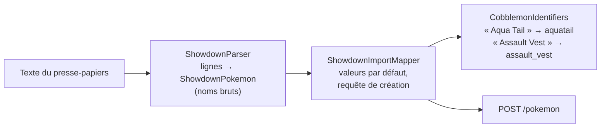

# 13. Logique pure et tests

## 13.1 Ce qu'on peut tester dans un mod

Un test JUnit s'exécute **sans lancer Minecraft**. Tout code qui appelle `Minecraft.getInstance()`, dessine, ou
manipule une entité ne peut pas y tourner. La stratégie du projet :

- **extraire** toute logique qui n'a pas besoin du jeu dans des classes « pures » (aucun import Minecraft) ;
- les **tester** en JUnit ;
- valider le reste (rendu, monde, interactions) par une **recette manuelle** en jeu
  (`../guides/testing-and-qa.md`).

| Classe pure | Ce qu'elle fait | Test |
|---|---|---|
| `pokemon/showdown/ShowdownParser` | Texte Showdown → objet | `ShowdownParserTest` |
| `pokemon/showdown/ShowdownImportMapper` | Objet → requête de création, valeurs par défaut | `ShowdownImportMapperTest` |
| `pokemon/showdown/CobblemonIdentifiers` | Noms d'affichage → identifiants Cobblemon | `CobblemonIdentifiersTest` |
| `pokemon/HiddenPowerCalculator` | Type de Puissance Cachée depuis les IV | `HiddenPowerCalculatorTest` |
| `pokemon/NatureModifiers` | Bonus/malus des natures | `NatureModifiersTest` |
| `pokemon/PokemonGender` | Sexe stocké ou imposé par l'espèce | `PokemonGenderTest` |
| `version/VersionCompatibility` | Comparaison de versions | `VersionCompatibilityTest` |
| `trade/LiveTradeState` | État de l'échange en direct | `LiveTradeStateTest` |
| (Gson) | Un `UUID` devient bien une chaîne JSON | `GsonUuidSanityTest` |

Configuration : le code du mod est dans le jeu de sources `client`, que Gradle ne relie pas aux tests par défaut ;
`build.gradle` l'ajoute au classpath de test (chapitre 3).

## 13.2 Exemple : l'import Showdown

Le format Showdown est le format texte standard des équipes Pokémon :

```text
Bichou (Samurott-Hisui) @ Assault Vest
Ability: Torrent
Shiny: Yes
Tera Type: Grass
EVs: 144 Atk / 64 Def / 136 SpD
Timid Nature
- Avalanche
- Aqua Tail
```

La chaîne est découpée en trois responsabilités, chacune testable seule :



```java
// ShowdownParserTest.java (raccourci)
@Test
void parsesTheCadReferenceExample() {
    ShowdownPokemon parsed = ShowdownParser.parseSingle(CAD_EXAMPLE);
    assertEquals("Bichou", parsed.nickname());
    assertEquals("Samurott-Hisui", parsed.speciesToken());
    assertEquals("Assault Vest", parsed.item());
    assertEquals(100, parsed.level());                    // niveau absent → 100 (convention Showdown)
    assertEquals(Integer.valueOf(144), parsed.evs().get("atk"));
}
```

Règles de conversion (vérifiées sur les fichiers de données de Cobblemon) :

```java
// CobblemonIdentifiers.java (raccourci)
public static String slugConcat(String displayName) {        // espèces, formes, attaques
    // minuscules, tout caractère non alphanumérique supprimé : "Mime Jr." → "mimejr", "Body Slam" → "bodyslam"
}
public static String slugUnderscore(String displayName) {    // talents, objets, natures, types
    // minuscules, mots joints par "_" : "Assault Vest" → "assault_vest"
}
public static SpeciesForm splitSpeciesForm(String token) {   // "Samurott-Hisui" → samurott + hisui
    // sauf exceptions dont le tiret fait partie du nom : Ho-Oh, Porygon-Z, Jangmo-o, Nidoran-M…
}
```

Une règle algorithmique vérifiée contre les vraies données vaut mieux qu'une table de 1 000 lignes écrite à la main
et jamais à jour.

## 13.3 Exemple : l'état d'un échange en direct

L'écran d'échange affiche un état qui change au fil des messages du serveur. Cet état est isolé dans
`LiveTradeState`, sans aucun import Minecraft :

```java
public final class LiveTradeState {
    public static LiveTradeState fromSessionStarted(Map<String, Object> data) { … }   // TradeSessionStarted
    public void applyUpdate(Map<String, Object> data) { … }                           // TradeSessionUpdate
    public void markCompleted(Map<String, Object> data) { … }
    public void markCancelled(Map<String, Object> data) { … }
    public UUID ownOffer() { … }
    public PokemonDto partnerOfferPokemon() { … }
}
```

Le test lui donne des `Map` qui imitent **exactement** ce que Gson produit (piège : tous les nombres JSON
deviennent des `Double`, d'où `pokemon.put("level", 50.0)` dans le test). On vérifie ensuite l'état sans écran.

Principe de conception : l'état client **ne change jamais de lui-même**. Un clic envoie une requête ; seul le
message de retour du serveur modifie l'état. Le client ne peut donc pas afficher un échange qui n'a pas eu lieu.

## 13.4 Un test de garde-fou

```java
// GsonUuidSanityTest (principe)
// Vérifie que Gson, sur le classpath réel du projet, sérialise un UUID en "b1a4c2b0-…"
// et non en {"mostSigBits":…,"leastSigBits":…}.
```

Ce test ne teste pas notre code, mais une **hypothèse** dont tout dépend (chaque requête contient des UUID). Si une
mise à jour de Gson ou de Minecraft changeait ce comportement, le test échouerait immédiatement au lieu de laisser
partir des requêtes invalides.

## 13.5 Lancer

```bash
./gradlew test
```

40 tests au 2026-10-03. La CI GitHub les relance à chaque push.

## À retenir

- Extraire la logique sans Minecraft dans des classes pures, et la tester.
- Découper un traitement en étapes à responsabilité unique (analyser, appliquer les valeurs par défaut, convertir).
- Imiter fidèlement les données réelles dans les tests (types produits par Gson).
- Un test peut aussi protéger une hypothèse sur une bibliothèque.
