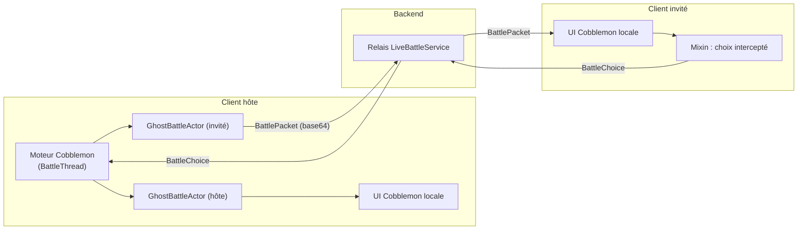

# Moteur de combat (client hôte)

> Paquet `client/battle`. Protocole : `Phantasmon-Backend/Documentation/reference/websocket-protocol.md` §5.
> Décision : D-05 ([`decisions.md`](decisions.md)). Vérifié le 2026-10-03.

## 1. Idée

Il n'y a pas de mod serveur, donc pas de combat Cobblemon côté serveur. L'un des deux clients, l'**hôte** (désigné
par le backend, en alternance), exécute **la pile de combat serveur de Cobblemon elle-même** (`PokemonBattle`,
Showdown via GraalJS, interpréteur d'instructions) ; aucun moteur n'est réécrit. Les deux joueurs voient
l'**interface de combat native de Cobblemon**, alimentée localement.

## 2. Déroulement

| Étape | Hôte | Invité |
|---|---|---|
| Invitation | Touche **B**, roue Cobblemon (« Combat Ghost », Nord-Ouest), ou `/phantasmon battle invite <joueur>` ; l'invité accepte par [Accepter] (`/phantasmon battle join`) ou refuse (`decline`) | |
| Démarrage | Reçoit `BattleSessionStarted` (rôle `HOST`, deux équipes) → `GhostBattles.startHostedBattle` | Reçoit `BattleSessionStarted` (rôle `GUEST`, sa propre équipe) |
| Ghost sortis | Rappelés par le backend au démarrage (les deux joueurs) ; toute sortie est refusée jusqu'à la fin (`ERROR_GHOST_IN_BATTLE`) | Idem |
| Pokémon | `GhostBattlePokemonFactory` construit un `Pokemon` Cobblemon **jetable** par Ghost (forme et aspects, niveau, nature, talent, IV/EV, attaques, objet, sexe, Téra, surnom). Le Ghost stocké n'est jamais modifié. | |
| Objet tenu | Posé directement (`setHeldItem$common`), **sans** `swapHeldItem` : ce dernier publie `HeldItemEvent`, dont le contexte MoLang appelle `server()!!` et faisait échouer le démarrage quand l'hôte est un client pur (invité LAN) | |
| Paquets | Les paquets destinés à l'invité sont encodés avec leur codec Cobblemon (`CobblemonPackets.encode`) et envoyés en `BattlePacket` | N'accepte que les paquets `cobblemon:battle_*` et `phantasmon:action_effect` (`RelayedPacketPolicy`, vérifié **avant** décodage ; le reste est journalisé et ignoré, SEC-2), puis les décode et les remet au gestionnaire client de Cobblemon (`CobblemonPackets.dispatchLocally`), comme s'ils venaient du serveur |
| Choix | Les choix de son UI sont interceptés par un Mixin et appliqués au moteur | Ses choix (`BattleSelectActionsPacket`) sont interceptés et envoyés en `BattleChoice` ; l'hôte les applique (`GhostBattles.applyChoice`) |
| Fin | Envoie `BattleResult` (vainqueur ou nul) | |
| Abandon / déconnexion | `BattleLeave` = défaite ; déconnexion = combat `ABORTED` sans vainqueur | idem |

## 3. Fil d'exécution (`BattleThread`)

Le moteur de Cobblemon est du code serveur mono-thread (contexte GraalJS + `BattleRegistry` « tické »).

- **Serveur intégré présent** (monde solo, hôte « Ouvrir au LAN ») : tout est soumis au thread de ce serveur, qui a
  déjà un Showdown démarré et tique `BattleRegistry`. Un second thread sur le même contexte GraalJS le ferait
  planter.
- **Client pur** (connecté à un serveur distant ou invité LAN) : un thread démon privé `phantasmon-battle` démarre
  Showdown une fois (espèces du registre synchronisé, scripts JS d'objets du jar Cobblemon), tique `BattleRegistry`
  toutes les 50 ms et fait avancer les `ServerTaskTracker` de Cobblemon (délais d'animation).
  `DistributionUtilsMixin` redirige vers ce thread les `runOnServer` qui, sans serveur, seraient perdus.

## 4. Acteurs (`GhostBattleActor`)

- Son UUID est l'UUID Mojang du joueur : c'est ainsi que l'UI de Cobblemon reconnaît « mon camp ».
- Il ne déclare **aucun** joueur serveur, pour que le moteur ne cherche jamais de `ServerPlayer` ni n'envoie de
  vrais paquets par le serveur intégré.
- Chaque paquet qui lui est adressé va à un « puits » : l'UI locale (acteur de l'hôte) ou l'encodeur vers le
  backend (acteur de l'invité). Il envoie lui-même `BattleInitializePacket`, que Cobblemon ne réserve qu'à sa
  classe `PlayerBattleActor`.
- `placeStartingPokemon` remplit les emplacements actifs depuis la requête Showdown (Cobblemon le fait
  normalement via l'entité qu'il fait sortir dans le monde).

## 5. Mise en scène (`BattleVisuals`)

Chaque client place le Pokémon actif de chaque camp devant son dresseur (entité purement locale, tournée vers
l'adversaire, à 3 blocs au plus sur la ligne entre les deux joueurs), avec les animations de Cobblemon : geste et
son de lancer, faisceau de sortie (`BEAM_MODE = 1`, 0,5 s + 1,5 s), cri, anneau chromatique ; au changement ou au
K.O., faisceau de rappel puis sortie du suivant. Piloté uniquement par les paquets reçus : hôte et invité
construisent la même scène sans trafic supplémentaire.

Forme, chromatique et sexe : comme pour les Ghost dans le monde, les **aspects** reçus dans le paquet sont écrits à
la main dans `PokemonEntity.ASPECTS` (le moteur de rendu ne lit que ces données synchronisées, qu'aucun serveur ne
remplit ici). Côté hôte, `GhostBattlePokemonFactory` force les aspects de la forme **en dernier**, avec `shiny` et
`male`/`female`, pour qu'ils partent complets dans les paquets.

## 6. Animations d'attaque

Cobblemon décrit chaque attaque, boost, statut… par une **action effect** : une timeline JSON
(`data/<ns>/action_effects/**.json`) jouée côté serveur contre des entités serveur. Un combat Ghost n'en a pas.

| Pièce | Rôle |
|---|---|
| `ActionEffectTimelineMixin` | Sur l'hôte, pour un combat Ghost, n'exécute pas la timeline côté serveur et la confie à `GhostActionEffects.intercept` |
| `ActionEffectInstructionsMixin` + `MoveInstructionMixin` | Relient l'effet à son instruction (lanceur, cibles, ratés, nombre de coups) |
| `ActionEffectEvent` | Identifiant de la timeline + positions Showdown (`p1a`, `p2a`…) + ces informations ; relayé à l'invité dans un `BattlePacket` d'identifiant `phantasmon:action_effect`, dans l'ordre des autres paquets |
| `ActionEffectPlayer` | Lecteur client des mêmes timelines (même sémantique, mêmes requêtes MoLang `q.move.*`, `q.missed(...)`…), joué directement sur les entités de `BattleVisuals`. `move_to_target` / `return_to_position` deviennent un glissement en ligne droite. |
| `ClientActionEffects` | Sur un client pur, remplit le registre des action effects depuis les jars des mods (Cobblemon et addons), avec le parseur de Cobblemon. Indispensable aussi au moteur de l'hôte (`BoostInstruction` déréférence `boost` avec `!!`). |

Rythme : comme dans Cobblemon, le moteur attend l'impact (hold `effects`) pour faire baisser les PV et la fin de
l'animation avant l'attaque suivante ; ces signaux suivent la lecture sur l'hôte. Une sécurité libère le combat
après 20 s si une lecture ne se termine pas.

## 7. Chrono

- Désactivé par défaut. L'un ou l'autre joueur l'active pour les deux (bouton [Activer le chrono] dans le chat ou
  `/phantasmon battle timer`), sans retour possible.
- 90 s par choix ; l'hôte applique l'action automatique (IA aléatoire de Cobblemon) pour les deux camps, avec 3 s
  de marge réseau pour l'invité.
- Chaque client affiche son propre compte à rebours dans la barre d'action (rouge sous 10 s).

## 8. Limites connues

- Un client hôte modifié peut fausser le résultat (limite assumée par le CAD).
- Sur un client pur, seules les action effects des **jars de mods** sont chargées, pas celles des datapacks du monde.
- Le moteur dépend d'internes de Cobblemon 1.8.1 (voir [`mixins.md`](mixins.md)) : à revalider à chaque mise à jour.
- `ERROR_BATTLE_NOT_IN_BATTLE` reçu juste après la fin d'un combat (paquets tardifs) est ignoré volontairement.
