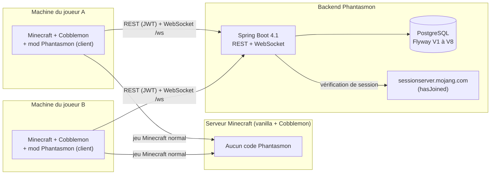
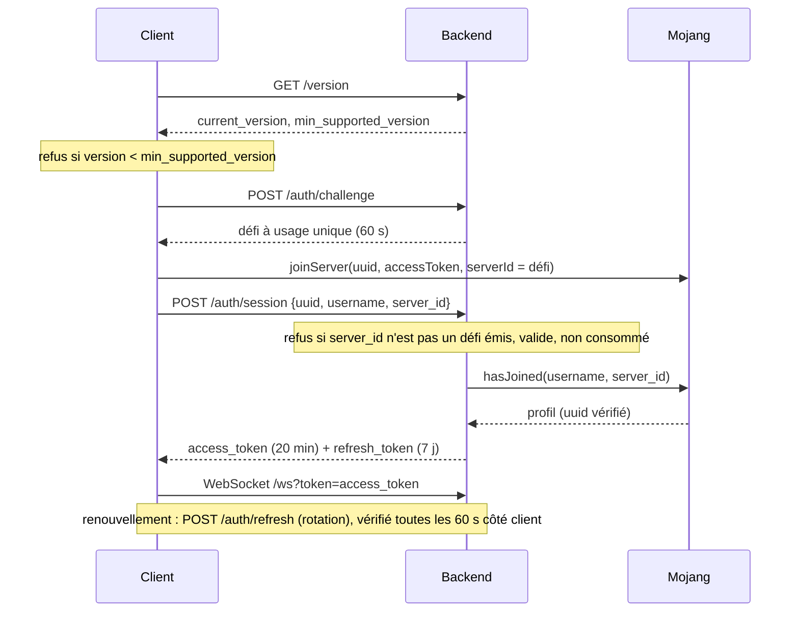
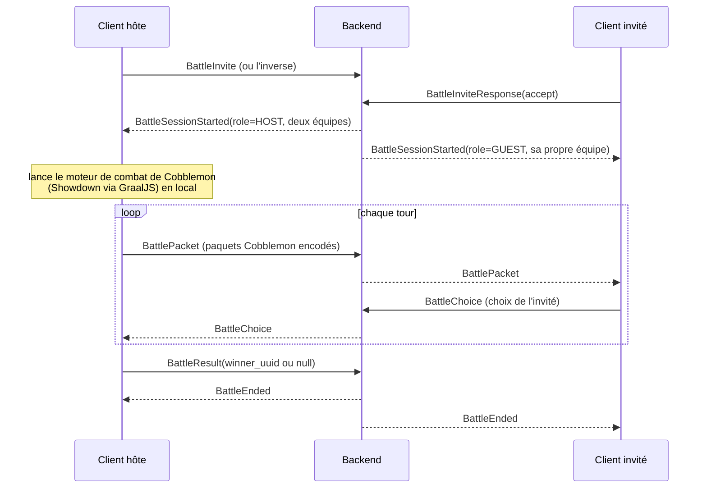

# Vue d'ensemble du système Phantasmon

> **Document miroir** : ce fichier existe à l'identique dans `Phantasmon-Backend/Documentation/architecture/`
> et `Phantasmon-Client/Documentation/architecture/`. Toute modification doit être reportée dans les deux.
>
> **Dernière vérification contre le code** : 2026-10-03.

Ce document décrit l'architecture **réellement implémentée** du système. L'intention d'origine est dans le
cahier des charges ([`specifications/`](../specifications/README.md)) ; les écarts entre les deux sont
justifiés dans [`decisions.md`](decisions.md).

---

## 1. En une phrase

Phantasmon permet aux joueurs de Minecraft 1.21.1 + Cobblemon 1.8.1 de créer, éditer, faire sortir, échanger
et faire combattre des **Ghost Pokémon** (des Pokémon virtuels, indépendants des données Cobblemon), sans
aucun code sur le serveur Minecraft : un mod **client uniquement** dialogue avec un **backend indépendant**,
seule source de vérité.

## 2. Composants

| Composant | Dépôt | Technologie | Rôle |
|---|---|---|---|
| Mod client | `Phantasmon-Client` | Fabric, Java 21, Minecraft 1.21.1, Cobblemon 1.8.1, mappings Mojang officiels | Interface (commandes, écrans PC/éditeur/échange), rendu des Ghost, hôte des combats, dialogue avec le backend |
| Backend | `Phantasmon-Backend` | Spring Boot 4.1.1, Java 21, PostgreSQL, Flyway, jjwt | Identité, données des Pokémon, légalité, échanges atomiques, présence, relais temps réel, enregistrement des combats |
| Serveur Minecraft | — | Vanilla / Fabric + Cobblemon | Ne sait rien de Phantasmon. Un joueur sans le mod ne voit rien. |

## 3. Principes non négociables

1. **Aucun code Phantasmon côté serveur Minecraft.** Les Ghost sont des entités purement locales à chaque client.
2. **Les clients ne se parlent jamais directement** : tout passe par le backend (REST pour les données, un seul
   WebSocket par client pour le temps réel).
3. **Le backend est la source de vérité** : propriété, légalité, échanges, résultats de combat. Le client n'est
   jamais cru sur parole pour une opération sensible ; la propriété est revérifiée en base à chaque fois.
4. **Pas de duplication des données Cobblemon** : le backend stocke des identifiants (`species`, `form`,
   `ability`, `moves`, objet tenu…), jamais de statistiques, modèles ni animations. Chaque client les résout
   avec son propre Cobblemon.
5. **Erreurs structurées** `{"error_code": "ERROR_…", "details": {…}}`, traduites localement par le client
   (français et anglais, aucune chaîne en dur).
6. **Gameplay fermé** : pas d'XP, d'évolution, d'élevage ni de combat contre des Pokémon sauvages réels.

## 4. Flux principaux

### 4.1 Connexion (authentification Mojang → JWT)

- Déclenchée **automatiquement** à l'entrée dans un monde si `GET /health` répond `UP`/`UP` (silencieuse sinon),
  ou manuellement par `/phantasmon login`.
- Le JWT n'est **jamais écrit sur disque** côté client. Les comptes hors-ligne sont refusés avant tout appel réseau.

### 4.2 Données des Pokémon (REST)

CRUD par `/pokemon` et `/players/{uuid}/…`. Chaque Pokémon est **soit** dans le PC (16 boîtes × 30 cases),
**soit** dans l'équipe active (6 emplacements), jamais les deux. Un déplacement vers une case occupée **échange**
les deux Pokémon, quelle que soit la combinaison PC/équipe. La création est idempotente (`request_uuid`).

### 4.3 Présence et Ghost (WebSocket)

- Chaque client envoie `JoinServerGroup` (empreinte du serveur Minecraft + dimension), puis toutes les secondes
  `PositionUpdate` et `Heartbeat`.
- Le backend regroupe en mémoire les joueurs ayant la même empreinte (`SHA-256` de l'adresse du serveur, ou
  `"singleplayer"`) **et** la même dimension.
- `SendOutGhost` (Pokémon de l'équipe uniquement) → `GhostEntitySpawn` diffusé au groupe **et** au propriétaire ;
  chaque client crée alors localement une entité `PokemonEntity` de Cobblemon, sans IA, qui suit son propriétaire.
- Un joueur sans heartbeat depuis 30 s est retiré (balayage toutes les 10 s) et son Ghost disparaît chez les autres.

### 4.4 Échanges

| Mode | Canal | Déroulement |
|---|---|---|
| **Échange en direct** (mode principal) | WebSocket | Invitation (60 s) → les deux voient l'équipe de l'autre → chacun choisit son offre → les deux se déclarent prêts → une transaction échange propriétaires **et** emplacements d'équipe, et enregistre une ligne `trades` `COMPLETED`. |
| **Échange asynchrone** (commandes) | REST | `POST /trades` (offre par UUID) → `accept` ou `cancel` plus tard. Les Pokémon reçus vont au premier emplacement libre du PC. |

### 4.5 Combats (modèle « client hôte »)

- Le backend **ne simule rien** : il gère l'invitation, désigne l'hôte (alternance entre deux mêmes joueurs),
  relaie les paquets, gère le chrono optionnel et enregistre le résultat dans `battle_sessions`.
- L'interface de combat est **celle de Cobblemon**, alimentée localement ; les animations (sorties, rappels,
  attaques) sont rejouées par chaque client sur ses propres entités.
- Limite assumée : un client hôte modifié pourrait fausser un résultat (voir [`decisions.md`](decisions.md), D-05).

## 5. Ce qui vit où

| Donnée | Où | Persistance |
|---|---|---|
| Joueurs, Pokémon, historique des échanges, sessions de combat, clés d'idempotence | PostgreSQL (backend) | Durable |
| Présence (groupe, position, Ghost sorti, dernier heartbeat) | Mémoire du backend (`PresenceService`) | Volatile |
| Sessions d'échange en direct et invitations | Mémoire du backend (`LiveTradeService`) | Volatile |
| État des combats en cours, invitations, chrono | Mémoire du backend (`LiveBattleService`) + moteur sur le client hôte | Volatile |
| JWT | Mémoire du client (`AuthSession`) | Volatile |
| Statistiques de base, modèles, animations, noms traduits | Cobblemon installé chez chaque joueur | — |

Le backend tourne en **instance unique** : présence et routage WebSocket ne sont pas partagés entre instances.

## 6. Pour aller plus loin

| Sujet | Backend | Client |
|---|---|---|
| Architecture détaillée | `architecture/backend-architecture.md` | `architecture/client-architecture.md` |
| Contrats | `reference/rest-api.md`, `reference/websocket-protocol.md`, `reference/error-codes.md` | `reference/commands-and-keybinds.md` |
| Données | `reference/database-schema.md` | — |
| Avancement, limites connues | `project/status.md` | `project/status.md` |
