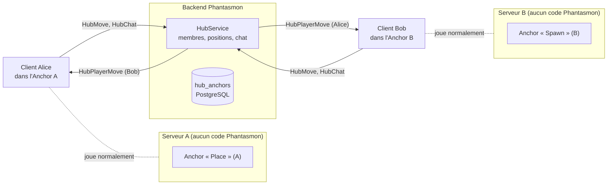

# Phantasmon Network — Cahier des charges

> **Document miroir** : identique dans `Phantasmon-Backend/Documentation/specifications/` et
> `Phantasmon-Client/Documentation/specifications/`. Toute modification doit être reportée dans les deux.
>
> **Rédigé le 2026-10-07**, sur la base de la note de recherche
> [`research/Phantasmon_Evolution_InterServeurs.md`](../research/Phantasmon_Evolution_InterServeurs.md), puis
> complété le même jour avec les réponses d'Adrien (taille, capacité, quota, chat, branche).
> **Précisé le 2026-10-07 (D-30)** : les Anchors sont partagés entre les joueurs d'un même serveur, jamais entre serveurs.
> **Statut : jalons 1 (« Hub social minimal ») et 2 (« Interactions ») terminés et validés en jeu le 2026-10-07.** Les jalons suivants sont seulement esquissés.

---

## 1. Point de départ

Adrien a déclaré le **Core terminé le 2026-10-07** : les phases 0 à 9 du CAD sont livrées et validées en jeu. Il ne
reste sur le Core que du polish (UI, VFX, SFX, animations), qui continue en parallèle.

Phantasmon Network transforme Phantasmon en **couche de présence et d'interaction entre plusieurs serveurs
Minecraft indépendants**, toujours **sans aucun code côté serveur Minecraft**. Les joueurs restent sur leurs
serveurs ; le backend Phantasmon les réunit dans un espace virtuel commun, le **Global Hub**.

Ce document fixe les décisions, le périmètre du premier jalon et la roadmap. Il complète le CAD Core (Parties 1 à 4)
sans le remplacer : tout ce qui n'est pas redéfini ici (authentification, données des Pokémon, échanges, combats,
erreurs structurées, i18n, TDD) reste régi par le CAD Core et par [`decisions.md`](../architecture/decisions.md).

## 2. Décisions de départ

| Sujet | Décision | Référence |
|---|---|---|
| Branche | Network est développé directement sur `dev`, comme le polish du Core ; pas de fork ni de branche dédiée. | [D-27](../architecture/decisions.md#d-27--phantasmon-network-développé-sur-dev) |
| Premier jalon | Hub social minimal : Anchors, Global Hub, avatars des joueurs distants, leurs Ghost, chat du Hub. | §4 |
| Création des Anchors | **Tout joueur** authentifié peut créer un Anchor, **un seul par joueur** ; suppression par le créateur ou un admin (D-26). | [D-28](../architecture/decisions.md#d-28--hub-anchors-créables-par-tout-joueur) |
| Partage des Anchors | Un serveur **partage** ses Anchors entre ses joueurs (tous les voient et peuvent les utiliser) ; deux serveurs ne se les partagent **jamais**. | [D-30](../architecture/decisions.md#d-30--hub-anchors-partagés-au-sein-dun-serveur-jamais-entre-serveurs) |
| Entrée dans le Hub | Jamais automatique : entrer dans un Anchor **propose** de rejoindre le Hub ; le joueur accepte explicitement (ou active l'acceptation automatique pour cet Anchor). | [D-29](../architecture/decisions.md#d-29--entrée-dans-le-global-hub-sur-consentement-explicite) |
| Forme et capacité | Anchor = **cube de 21 × 21 × 21 blocs** ; **un seul Hub, public**, limité à **50 joueurs** simultanés. | §5.2, §5.3 |

## 3. Principes (hérités et nouveaux)

Hérités du Core, inchangés :

1. **Aucun code Phantasmon sur un serveur Minecraft.** Le serveur reste maître de la position réelle, de la gravité,
   des collisions, des blocs et des chunks.
2. **Les clients ne se parlent jamais directement** ; aucune connexion entre serveurs. Tout passe par le backend.
3. **Le backend est la source de vérité**, la présence reste **en mémoire** (instance unique, pas de Redis).
4. Erreurs structurées `ERROR_*`, traductions FR + EN, TDD côté backend et logique pure côté client.

Nouveaux :

5. **Le Hub est une superposition virtuelle, pas une reconstruction.** Aucun bloc distant n'est recréé. Les avatars
   distants sont purement visuels : pas de collision, pas de hitbox côté serveur, invisibles pour un joueur sans le mod.
6. **Position partagée horizontale.** Seuls `x`, `z`, l'orientation et la hauteur au-dessus du sol sont partagés ; la
   hauteur du sol sous un avatar est calculée localement par chaque client (§5.4). La hauteur du cube sert à
   détecter si le joueur est dans l'Anchor, pas à placer les avatars.
7. **Le Hub ne divulgue jamais l'adresse d'un serveur ni des coordonnées réelles.** Les autres membres du Hub ne
   reçoivent que des coordonnées relatives à l'Anchor.
8. **Présence en deux contextes.** Un joueur dans le Hub reste membre du groupe de son serveur (Core) ; les deux
   audiences sont servies séparément ; un avatar n'est masqué que s'il ferait doublon avec le vrai joueur (§5.6).
9. **Rien ne transite par le serveur Minecraft**, pas même le chat du Hub (§5.8).

## 4. Jalon 1 — Hub social minimal

### 4.1 Expérience joueur

1. Sur son serveur, un joueur se place sur une zone dégagée et tape `/phantasmon hub anchor create <nom>`. Un Anchor
   cubique de 21 × 21 × 21 est créé : centré sur lui horizontalement, posé au niveau de ses pieds, orienté selon son
   regard.
2. Tous les joueurs Phantasmon **du même serveur** voient l'Anchor et peuvent l'utiliser ; ceux d'un autre serveur ne
   le voient jamais (D-30). Contour du carré au sol en particules, nom flottant.
3. En entrant dans le cube d'un Anchor de son serveur, un joueur reçoit une invitation : « Rejoindre le Global Hub ?
   [Oui] [Non] [Toujours ici] ».
4. Une fois dans le Hub, il voit les **avatars** de tous les autres membres, chacun placé dans l'Anchor local selon
   sa position dans le Hub : skin, pseudo, marche, saut, orientation de la tête, accroupissement, et leur Ghost s'ils
   en ont sorti un.
5. Il peut **écrire dans le chat du Hub** ; les messages s'affichent dans le chat local, préfixés `[Hub]`, et ne
   sont jamais envoyés au serveur Minecraft.
6. En sortant du cube (ou avec `/phantasmon hub leave`), il quitte le Hub et les avatars disparaissent.

Hors jalon 1 : échange et combat avec un avatar distant, spectateurs, émotes, Hubs privés, voix (voir §7).

### 4.2 Critères de fin du jalon 1

- Deux joueurs sur **deux serveurs Minecraft différents** (deux serveurs locaux sur des ports différents suffisent)
  se voient mutuellement dans le Hub, se déplacent de façon fluide, avec leur skin et leur Ghost.
- Ils s'écrivent par le chat du Hub ; un joueur hors du Hub, ou sans le mod, ne voit pas ces messages, et le
  serveur Minecraft ne les reçoit pas.
- Deux joueurs du **même serveur** dans le même Anchor se voient pour de vrai, sans doublon ; par deux Anchors
  différents de ce serveur, ils se voient en avatar.
- Le 51ᵉ joueur est refusé proprement (`ERROR_HUB_FULL`, message traduit).
- Aucune correction de position (rubber-banding) ni refus anti-cheat côté serveur : rien n'est envoyé au serveur.
- Quitter le Hub, se déconnecter ou perdre le backend fait disparaître proprement avatars et Ghost distants.
- Tests backend : transformation et bornes, capacité, quota, droits de suppression, anti-doublon, chat, TTL.
- Documentation de référence à jour (REST, WebSocket, codes d'erreur, schéma, configuration).

## 5. Conception du jalon 1

### 5.1 Vue d'ensemble



### 5.2 Hub Anchor

Donnée **persistante** (nouvelle table, migration `V11`), propriété du backend :

| Champ | Type | Règle |
|---|---|---|
| `uuid` | UUID | Généré par le backend |
| `owner_uuid` | UUID | FK `players`, **unique** (un Anchor par joueur) |
| `name` | texte | 3 à 32 caractères, lettres, chiffres, espaces, `-` `_` ; unique par serveur |
| `server_fingerprint` | texte | Empreinte du serveur (D-18), jamais l'adresse |
| `dimension` | texte | Ex. `minecraft:overworld` |
| `origin_x`, `origin_y`, `origin_z` | double | Position des pieds du créateur à la création |
| `yaw` | entier | 0, 90, 180 ou 270 : l'orientation envoyée est arrondie au quart de tour le plus proche (les cubes restent alignés sur la grille) |
| `created_at` | timestamptz | |

- **Géométrie** : `phantasmon.hub.anchor-size` = 21. Le cube couvre `origin ± 10` en `x` et `z`, et
  `origin_y` à `origin_y + 20` en hauteur. Tous les Anchors ont la même taille : l'espace du Hub est un carré de
  21 × 21, identique sur tous les serveurs.
- **Quota** : un Anchor par joueur (contrainte d'unicité) → `ERROR_HUB_ANCHOR_QUOTA` ; pour en poser un ailleurs, le
  joueur supprime d'abord le sien.
- **Suppression** : par le créateur ou un admin (D-26) → sinon `ERROR_HUB_ANCHOR_FORBIDDEN`.
- **Partage** (D-30) : listé et utilisable par tous les joueurs de son serveur et de sa dimension, jamais depuis un
  autre serveur.
- **Pas de vérification physique possible** : sans mod serveur, le backend ne peut pas vérifier que le créateur se
  trouve réellement sur ce serveur à cette position. Limite assumée, compensée par D-29 (consentement) et la
  suppression par un admin.

Routes REST (JWT) :

| Méthode | Route | Effet |
|---|---|---|
| `GET` | `/hub/anchors?server_fingerprint=…&dimension=…` | Anchors de ce serveur et de cette dimension (pour l'affichage et la détection d'entrée) |
| `GET` | `/hub/anchors/mine` | L'Anchor du joueur (404 s'il n'en a pas) |
| `POST` | `/hub/anchors` | Création (`request_uuid` idempotent, comme `POST /pokemon`) |
| `DELETE` | `/hub/anchors/{id}` | Suppression ; les membres du Hub entrés par cet Anchor en sont retirés |

Commandes client : `/phantasmon hub anchor create <nom>`, `… info`, `… delete`, `/phantasmon hub leave`,
`/phantasmon hub autojoin <on|off>`, `/phantasmon hub chat <message>` (alias court `/hc <message>`).

### 5.3 Global Hub

- Un **seul Hub, public**, sans découpage en instances au jalon 1.
- Capacité : `phantasmon.hub.capacity` = 50 joueurs simultanés. Au-delà, `HubJoin` répond `ERROR_HUB_FULL` ; le
  client le signale et retente seulement si le joueur ressort puis rentre dans l'Anchor.
- L'état du Hub est **en mémoire** (`HubService`), comme `PresenceService` : Anchor d'entrée, position Hub,
  orientation, pose, dernier `HubMove`.
- Pas de filtrage d'intérêt au jalon 1 : sur un carré de 21 × 21, chacun voit tout le monde. Le coût d'un relais à
  10 Hz pour 50 joueurs (≈ 25 000 messages/s sortants au pire, tous en mouvement) est acceptable pour une instance ;
  à mesurer pendant N2. Envoi seulement sur changement.
- Hubs privés et instances multiples : TODO-29 et TODO-30.

### 5.4 Transformation des coordonnées

Calculée **côté client** ; le backend ne connaît que les coordonnées Hub et vérifie qu'elles restent dans le carré
(`|hx| ≤ 10,5` et `|hz| ≤ 10,5`, sinon `ERROR_HUB_OUT_OF_BOUNDS`).

```text
Local → Hub :  (dx, dz) = (x - origin_x, z - origin_z)
               (hx, hz) = rotation(dx, dz, -anchor.yaw)
               y_offset = y - hauteur du sol local sous le joueur (0 au sol, > 0 en saut)
Hub → Local :  (dx, dz) = rotation(hx, hz, +anchor.yaw)
               (x, z)   = (origin_x + dx, origin_z + dz)
               y        = hauteur du sol local en (x, z), bornée au cube ; sinon origin_y ; + y_offset
               yaw_local = yaw_hub + anchor.yaw
```

Ainsi un avatar marche toujours sur le sol de l'Anchor local, quel que soit le relief des autres serveurs.

### 5.5 Avatars distants (client)

- Entité **purement client**, ajoutée au `ClientLevel` comme les Ghost (`ClientLevel#addEntity`), avec un identifiant
  hors de la plage du serveur ; aucune collision, non ciblable par le serveur.
- Base envisagée : une sous-classe de `RemotePlayer` (rendu joueur vanilla, animations de marche gratuites). Le skin
  se résout par le profil Mojang (`MinecraftSessionService` / `SkinManager`), car un faux joueur n'a pas de
  `PlayerInfo` dans la connexion : il faudra surcharger la récupération du skin (sous-classe ou Mixin, D-15).
- Interpolation : positions reçues à 10 Hz, rendu lissé sur ~100 ms, comme D-11 pour les Ghost.
- Étiquette : pseudo + marque discrète « Hub ». Rien n'indique de quel serveur vient l'avatar (choix d'Adrien).
- Ghost d'un joueur distant : réutilise `GhostEntityManager`, ancré sur l'avatar au lieu d'un joueur réel.
- Points à vérifier au prototype : un faux `RemotePlayer` ne doit pas apparaître dans la liste des joueurs (Tab), ni
  perturber les mods de la modpack qui parcourent `level.players()` (voir les conflits connus avec catchindicator,
  DeltaClient et ShoulderSurfing).

### 5.6 Deux contextes de présence, sans doublon

- Le joueur reste dans son **groupe serveur** (Core) : son Ghost reste visible des joueurs de son serveur, en
  coordonnées réelles, exactement comme aujourd'hui.
- Dans le **Hub**, son avatar et son Ghost sont diffusés aux autres membres, en coordonnées Hub.
- Le backend envoie à chaque membre **tous** les autres. Un avatar montre où son joueur se trouve dans le Hub, pas
  dans le monde : deux joueurs du même serveur entrés par deux Anchors différents se voient donc en avatar.
- Seul cas de doublon : le vrai joueur est chargé dans le monde local et se tient dans le cube de l'Anchor par lequel
  ce client est entré — les deux sont dans le même Anchor, son avatar serait exactement à sa place. Le client masque
  alors l'avatar et son Ghost du Hub (son vrai Ghost est déjà affiché par le groupe serveur), et les réaffiche quand
  ce n'est plus le cas.
- > **Note d'implémentation (2026-10-07, D-30)** : la première version faisait l'inverse (aucun avatar entre joueurs
  > de même empreinte et même dimension, côté backend) ; elle cachait tout dès que deux comptes partageaient un serveur.

### 5.7 Protocole WebSocket

> **Note d'implémentation (2026-10-07, N2)** : le contrat réel est dans `reference/websocket-protocol.md` §6 bis
> (dépôt Backend). Écarts avec l'ébauche ci-dessous : `HubJoin` prend `anchor_uuid` (un Anchor du serveur du joueur) ; l'état d'un avatar est un
> objet `state` (`HubJoined`, `HubPlayerEnter`, `HubPlayerMove`) ; un message `HubLeft { reason }` confirme la
> sortie au joueur concerné ; le Ghost d'un membre déjà présent arrive dans son entrée de `HubJoined` (`ghost`) ;
> `HubMove` porte en plus `skin_parts` (couches du skin et cape).

| Sens | Message | `data` | Effet |
|---|---|---|---|
| C2S | `HubJoin` | `{ "anchor_id" }` | Vérifie l'Anchor (existe, même empreinte et dimension que la présence du joueur) et la capacité ; répond `HubJoined` |
| C2S | `HubLeave` | `{}` | Retire le joueur du Hub |
| C2S | `HubMove` | `{ "x", "z", "y_offset", "yaw", "head_yaw", "pitch", "pose": "STANDING"\|"CROUCHING"\|…, "on_ground" }` | Coordonnées Hub ; envoyé à 10 Hz **seulement si quelque chose a changé** |
| C2S | `HubChat` | `{ "message" }` | Message du chat du Hub (§5.8) |
| S2C | `HubJoined` | `{ "members": [ … ] }` | État initial : avatars visibles et Ghost sortis |
| S2C | `HubPlayerEnter` | `{ "player_uuid", "username", "position", "pose" }` | Un joueur entre dans le Hub |
| S2C | `HubPlayerMove` | `{ "player_uuid", … }` | Relais de `HubMove` |
| S2C | `HubPlayerLeave` | `{ "player_uuid" }` | Sortie du Hub, suppression de son Anchor, déconnexion ou TTL |
| S2C | `HubGhostSpawn` / `HubGhostDespawn` | comme `GhostEntitySpawn` / `GhostEntityDespawn`, sans position réelle | Ghost d'un membre du Hub |
| S2C | `HubChatMessage` | `{ "player_uuid", "username", "message", "sent_at" }` | À tous les membres du Hub, expéditeur compris |

- Le limiteur de débit actuel (40 messages/s par connexion, SEC-5) laisse la place à 10 `HubMove`/s.
- Une fermeture de session ou une expiration TTL vaut `HubLeave` (même mécanique que `LeaveServerGroup`, BUG-4).
- Nouveaux codes d'erreur envisagés : `ERROR_HUB_FULL`, `ERROR_HUB_ANCHOR_NOT_FOUND`, `ERROR_HUB_ANCHOR_QUOTA`,
  `ERROR_HUB_ANCHOR_FORBIDDEN`, `ERROR_HUB_ANCHOR_NAME_TAKEN`, `ERROR_HUB_ANCHOR_WRONG_SERVER`,
  `ERROR_HUB_NOT_JOINED`, `ERROR_HUB_OUT_OF_BOUNDS`, `ERROR_HUB_CHAT_TOO_LONG`, `ERROR_HUB_CHAT_RATE_LIMITED`.

### 5.8 Chat du Hub

- **Envoi** : `/phantasmon hub chat <message>` ou `/hc <message>` (commandes client Fabric : rien ne part vers le
  serveur Minecraft). Un mode « chat Hub par défaut » (le chat normal bascule vers le Hub) est une amélioration
  possible, hors jalon 1.
- **Affichage** : dans le chat local, `[Hub] <pseudo> message`, couleur dédiée ; les messages reçus du backend sont
  ajoutés localement, ils ne sont pas signés et ne peuvent pas être signalés à Mojang comme un message de serveur.
- **Règles côté backend** : réservé aux membres du Hub (`ERROR_HUB_NOT_JOINED`) ; 256 caractères au plus
  (`ERROR_HUB_CHAT_TOO_LONG`) ; codes de formatage `§` retirés ; au plus 1 message par seconde et par joueur
  (`ERROR_HUB_CHAT_RATE_LIMITED`).
- **Traçabilité** : chaque message est écrit dans le journal du backend (expéditeur, horodatage), pas en base.
- **Modération** : rien au jalon 1 au-delà de ces règles ; outils admin (rendre muet, exclure du Hub) : TODO-31.

### 5.9 Sécurité et vie privée

| Risque | Traitement |
|---|---|
| Anchor posé par un inconnu au spawn d'un serveur, pour exposer les joueurs qui passent | D-29 : entrée seulement sur consentement ; aucune position n'est diffusée hors du Hub |
| Fuite de la base d'un joueur | Le Hub ne transmet que des coordonnées relatives à l'Anchor, jamais l'adresse du serveur. Amélioration par rapport à LIM-9 pour le Hub ; LIM-9 reste vrai pour le groupe serveur Core |
| Spam d'Anchors | Un Anchor par joueur, nom unique par serveur, visible seulement sur son serveur (D-30), suppression par admin |
| Abus du chat | Longueur, débit, formatage retiré, journalisation ; outils de modération en TODO-31 |
| Téléportation ou vitesse impossible dans le Hub | Le backend borne les coordonnées au carré ; pas d'anti-triche de vitesse au jalon 1 (cohérent avec le Core) |
| Charge (10 Hz × 50²) | Capacité de 50, envoi seulement sur changement ; à mesurer en N2 |

## 6. Plan de développement

Les étapes s'enchaînent comme dans le CAD Core : backend d'abord (TDD), puis client. Tout se fait sur `dev` (D-27).

| Étape | Dépôt | Contenu | Critère de fin |
|---|---|---|---|
| N0 | Les deux | Ce cahier des charges ; décisions D-27 à D-29 | Validé par Adrien |
| N1 | Backend | `hub_anchors` (V11), REST anchors, quota, droits, idempotence, codes d'erreur | Tests d'intégration verts, docs de référence |
| N2 | Backend | `HubService` : capacité, `HubJoin`/`HubLeave`/`HubMove`, chat, TTL et fermeture de session (anti-doublon revu par D-30 : côté client) | Tests WebSocket réels à 3 clients simulés sur 2 empreintes |
| N3 | Client | Commandes Anchor, affichage du cube, détection d'entrée/sortie, invitation de consentement, transformation de coordonnées (tests purs), chat du Hub | Anchor créé et visible en jeu ; chat fonctionnel |
| N4 | Client | Avatars distants : entité client, skin, interpolation, poses, étiquette ; envoi `HubMove` à 10 Hz | Deux comptes sur deux serveurs se voient bouger |
| N5 | Les deux | Ghost dans le Hub (`HubGhostSpawn`/`Despawn`, suivi de l'avatar) | Critères §4.2 tous remplis, validation en jeu par Adrien |

Tant que personne n'a créé d'Anchor, Network ne change rien au comportement du Core : il n'est donc pas nécessaire
de le masquer derrière un interrupteur, même s'il arrive sur `dev` avant d'être complet.

**Environnement de test nécessaire** : deux serveurs Minecraft + Cobblemon locaux (ports distincts, donc deux
empreintes) et deux comptes Mojang, comme pour les validations à deux comptes des phases 7 à 9.

## 7. Jalon 2 — Interactions (terminé le 2026-10-07)

Adrien : échange et combat avec l'avatar d'un joueur d'un autre serveur ; **pas d'émotes pour l'instant** (TODO-32).

### 7.1 Expérience joueur

1. Dans le Hub, le joueur vise l'avatar d'un joueur et appuie sur **R** (touche d'envoi de Cobblemon) : la roue
   d'interaction s'ouvre avec seulement **Échange Ghost** et **Combat Ghost** (les entrées de Cobblemon agissent sur le
   serveur Minecraft, qui ne connaît pas ce joueur).
2. L'invitation, l'écran d'échange, le lobby, l'intro et le combat sont ceux du Core : rien ne change pour l'invité,
   qui accepte par les boutons du chat.
3. En combat, l'avatar tient la place de l'adversaire : placement des Pokémon, caméra, intro (skin et couches de
   l'avatar), modèle 3D du lobby.

### 7.2 Conception

- **Backend : rien à changer.** Les invitations d'échange et de combat en direct ne vérifient que la connexion de la
  cible, jamais le groupe serveur ; un test WebSocket le fixe désormais (deux joueurs de deux empreintes, rencontrés
  dans le Hub, s'invitent).
- **Roue sur un avatar** (client) : la touche R de Cobblemon demande au serveur Minecraft les options d'un joueur
  visé ; pour un avatar, le serveur ne répondrait jamais. `PartySendBindingMixin` repère d'abord un avatar visé
  (10 blocs, bloc intermédiaire exclu) et ouvre localement `InteractWheelGUI` avec les deux entrées Ghost
  (`GhostWheelOptions.openOnAvatar`). L'avatar reste non ciblable par Minecraft (ni coup ni clic droit envoyés au
  serveur).
- **Adversaire d'un autre serveur** (client) : partout où le combat cherchait l'adversaire par
  `level.getPlayerByUUID` (`BattleVisuals`, `BattleCinematic`, lobby, intro), `HubAvatars.playerOrAvatar` rend le vrai
  joueur s'il est chargé, sinon son avatar.
- **Limite** : un joueur qui sort du Hub en plein combat (il quitte le cube de l'Anchor) n'a plus d'avatar chez
  l'autre ; le combat continue, l'affichage retombe sur les cas « adversaire non chargé » du Core (LIM-12).

### 7.3 Étapes

| Étape | Dépôt | Contenu | Critère de fin |
|---|---|---|---|
| N6 | Client | Roue Ghost sur un avatar ; test backend des invitations entre serveurs | Invitation reçue par un joueur d'un autre serveur |
| N7 | Client | Avatar comme adversaire : combat, caméra, lobby, intro | Combat complet contre un joueur d'un autre serveur |
| N8 | Les deux | Validation en jeu par Adrien : un échange et un combat entre deux serveurs | Jalon 2 terminé |

## 7 bis. Jalon « Hub bâti » — la construction du Global Hub (2026-10-08)

Demande d'Adrien : le Global Hub prend un aspect. Poser un Anchor ne délimite plus seulement une zone : chaque client
y **construit** une salle, une arène… à partir d'un schematic fourni par le backend. Ce sont de **faux blocs** : le
serveur Minecraft ne les connaît pas, le client si — même apparence, même éclairage, compatibles shaders, même
hitbox. Décision [D-34](../architecture/decisions.md#d-34--construction-du-global-hub-par-un-schematic-en-blocs-client).

### 7 bis.1 Règles (réponses d'Adrien du 2026-10-08)

| Sujet | Règle |
|---|---|
| Source | Dossier `hub_schematics/hub_global/` du backend : **un seul** fichier `.schem` (Sponge v1 à v3, WorldEdit) ou `.litematic` (Litematica) |
| Contrôle au démarrage | Exactement un fichier, lisible, de **la taille d'un Anchor** (21 × 21 × 21, `phantasmon.hub.anchor-size`) ; sinon le backend **refuse de démarrer** |
| Ancrage | Le centre de la couche du bas du schematic se place sur le bloc d'où l'Anchor est posé (colonne centrale, niveau des pieds) ; le schematic tourne avec l'Anchor (quart de tour, son +Z = l'avant de l'Anchor) |
| Pose d'un Anchor | Le cube 21 × 21 × 21, des pieds vers le haut, doit être **entièrement vide (air)** ; vérifié par le client avant l'appel au backend |
| Qui voit la construction | Tout joueur Phantasmon du serveur et de la dimension, dès que les chunks de l'Anchor sont chargés chez lui (distance de rendu) ; entrer dans le Hub n'est pas nécessaire |
| Faux blocs | Incassables ; on ne peut rien poser dessus ; portes, trappes et portillons s'ouvrent côté client seulement ; le reste est inerte |
| Blocs inconnus d'un client | Remplacés par de l'air (blocs de mods absents chez lui) |
| Risque serveur | **Accepté pour le moment** : debout sur un faux sol, le joueur flotte pour le serveur ; si `allow-flight=false`, celui-ci peut l'expulser (« Flying is not enabled ») ; un anti-triche peut réagir (LIM-14) |

### 7 bis.2 Conception

- **Backend** : `HubSchematicService` lit le dossier au démarrage (lecteur NBT minimal, sans code Minecraft), vérifie
  le fichier et sa taille, calcule son SHA-256 ; `GET /hub/schematic` (nom, format, SHA-256, taille) et
  `GET /hub/schematic/file` (le fichier tel quel). Le backend ne lit jamais les blocs eux-mêmes.
- **Client** : téléchargement mis en cache par SHA-256 (`config/phantasmon-hub-schematics/`) ; lecture des trois
  formats (`HubSchematic`) ; noms de blocs → blocs du client, inconnus → air ; disposition (`HubBuildLayout`) ;
  `HubBuilds` pose les blocs non-air dans le monde local (`setBlock` côté client : rendu, lumière, shaders et
  collisions par le moteur du jeu) ; ce que le serveur renvoie pour ces positions (mise à jour de bloc, chunk renvoyé)
  est mis de côté et la construction remise ; l'état réel revient à la suppression de l'Anchor.

### 7 bis.3 Étapes

| Étape | Dépôt | Contenu | Critère de fin |
|---|---|---|---|
| H0 | Les deux | Ce chapitre, D-34 | Relu par Adrien |
| H1 | Backend | Chargement et contrôle du schematic au démarrage ; `GET /hub/schematic`, `GET /hub/schematic/file` | Tests verts |
| H2 | Client | Cache par SHA-256 ; lecture `.schem` v1-v3 et `.litematic` ; disposition et rotation | Tests unitaires |
| H3 | Client | Vérification d'air à la pose ; faux blocs posés, remis après chaque envoi du serveur, retirés avec l'Anchor | La salle s'affiche en jeu |
| H4 | Client | Incassables, rien à poser dessus, portes / trappes / portillons locaux, blocs à contenu (panneaux…) au mieux | Validation en jeu par Adrien (avec Iris) |

## 7 ter. Plusieurs hubs (2026-10-08, D-35)

Les admins créent des hubs : `/phantasmon admin hub create <nom> <longueur> <largeur> <hauteur>` (base + dossier
`hub_schematics/hub_<nom>/`), `delete <nom>` (Anchors supprimés, dossier archivé), `reload <nom>` (relit le
schematic). Les joueurs posent un Anchor par hub : `/phantasmon hub anchor create <hub> [nom]`, noms de hubs suggérés
d'après le backend (nouveaux hubs visibles sans relancer le jeu) ; `/phantasmon hub list`. Chaque hub est un espace
séparé (membres, avatars, Ghost, chat, 50 joueurs) ; un hub sans schematic marche sans construction ; deux Anchors ne
se chevauchent jamais. L'ancien Global Hub est le hub `global`.

## 8. Jalons suivants (esquisse, non engagés)

| Jalon | Idée | Réutilise |
|---|---|---|
| 3 — Sessions | Modèle de session générique (`WAITING` → `READY` → `ACTIVE` → `FINISHED`) dont le combat devient un cas ; **spectateurs** d'un combat inter-serveurs | `LiveBattleService`, relais `BattlePacket` |
| 4 — Événements | Tournois inter-serveurs : inscriptions, appariement, arbre, statistiques | Sessions, `battle_sessions` |
| 5 — Identité | Profil Phantasmon, historique, amis, succès | Identité Mojang déjà vérifiée (auth `hasJoined`) ; à concevoir séparément (sécurité, confiance) |
| 6 — Hubs multiples | Hubs privés (TODO-29), instances au-delà de 50 joueurs (TODO-30), types de Hub (social, training, event), verticalité, décors virtuels | |
| Hors champ | Voix de proximité ; reconstruction de mondes distants ; physique virtuelle | — |

## 9. Questions ouvertes

Aucune pour le jalon 1. Réponses d'Adrien intégrées le 2026-10-07 : cube de 21 × 21 × 21, 50 joueurs, un Anchor par
joueur ; un seul Hub, public (Hubs privés en TODO-29) ; chat du Hub dans le jalon 1 ; développement sur `dev` ;
**aucune indication du serveur d'origine** d'un avatar (seuls le pseudo et la marque « Hub » sont affichés).
